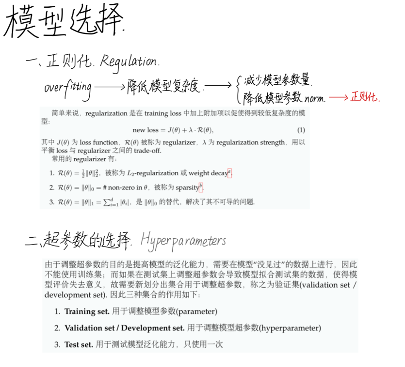
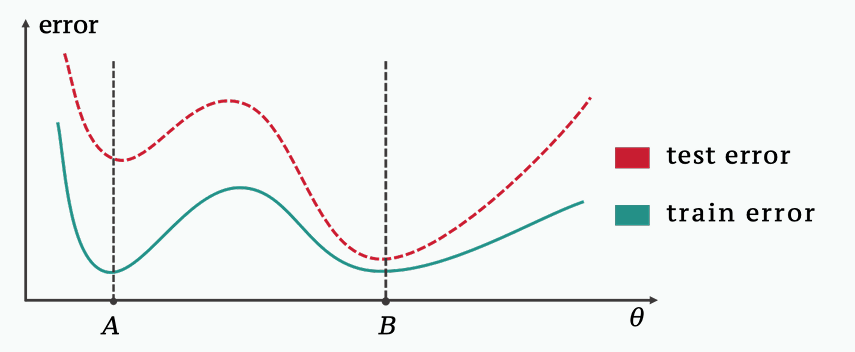
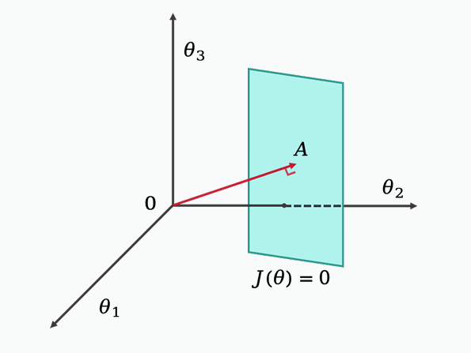

#  Standford CS229 2022Fall，第10讲：特征/模型选择，机器学习建议

## 思维导图

## 复杂度度量

在上一节中，overfitting与underfitting所围绕的核心是**模型复杂度**，部分可供选择的**复杂度度量**如下：

1. **参数数量**。即参数数量。但缺陷在于训练完的模型可能很多参数都很小甚至为0，导致实际参数量 < # parameters.

2. **参数范数**。常用范数有 $ \|\cdot\|_1 $, $ \|\cdot\|_2 $。可以解决某些参数为0的问题，但缺陷在于当范数过小时容易受到噪声影响.

3. **Lipschitzness/ Smoothness**。用于衡量模型表示函数的光滑性（这里暂略）。

## 如何降低模型复杂度？——正则化

解决overfitting的方法之一是降低**模型复杂度**。针对不同的complexity measure，其中一种方式是直接减小模型参数量，另一种方式是降低模型参数的norm，即**正则化**(regularization)。

简单来说，regularization是在training loss中加上附加项以促使得到较低复杂度的模型：

$$
\text{new loss} = J(\theta) + \lambda \cdot R(\theta)
$$

其中 $ J(\theta) $ 为 loss function，$ R(\theta) $ 被称为 regularizer，$ \lambda $ 为 regularization strength，用以平衡 loss 与 regularizer 之间的 trade-off。

常用的 regularizer 有：

1. $ R(\theta) = \frac{1}{2} \|\theta\|_2^2 $，被称为 L2-regularization 或 weight decay。

2. $ R(\theta) = \|\theta\|_0 = \# \text{ non-zero in } \theta $，被称为 sparsity。

3. $ R(\theta) = \|\theta\|_1 = \sum_{i=1}^d \|\theta_i\| $，是 $ \|\theta\|_0 $ 的替代，解决了其不可导的问题。

**注1**：Regularization实际上反映了模型的结构(structure)，这是建立在先验知识(prior belief)上的，例如若希望只使用一部分特征，那么就可以选择 $ \|\theta\|_0 $ 和 $ \|\theta\|_1 $；若相信每一个特征都会有作用，需要将他们组合起来使用，就需要选择 $ \|\theta\|_2 $。对于线性模型，$ J(\theta) + \|\theta\|_1 $ 被称为 LASSO；对于深度学习任务，使用的主要是 L2-regularization。

---

## 隐式正则化

### 动机

在现代深度学习模型往往是过参数化的(over-parameterized)，此时并没有很强的正则化(例如 regularization strength $ \lambda $ 很小或为 0)但是仍然有很好泛化能力。一种解释是在优化过程中发生了**隐式正则化**(implicit regularization)。

对于 training loss 来说，其 loss landscape 可能有很多局部极小点(local minima)甚至有数个极小点，但是 implicit regularization 会让模型最终选择更好的，即使得 test error 更小的模式。如下图1所示，对于 training error 来说 A, B 均为极小点，但是对于 test error 来说 B 点是极小点，implicit regularization 的作用就是使得在优化过程中选择 B 模型使其泛化能力更好(test error 更小)。
> 
> Figure 1: Implicit regularization example

### 示例 - 线性模型

考虑过参数化(over-parameterized)的线性模型：给定训练集 $ \{(x^{(1)}, y^{(1)}), (x^{(2)}, y^{(2)}), \cdots, (x^{(n)}, y^{(n)})\} $，其中 $ x^{(i)} \in \mathbb{R}^d $，$ n \ll d $，损失函数

$$
J(\theta) = \frac{1}{n} \sum_{i=1}^n (y^{(i)} - \theta^T x^{(i)})^2
$$

在 $ J(\theta) = 0 $ 时，模型达到0训练误差。从 $ \theta = 0 $ 初始化的梯度下降(GD)优化该模型会收敛至 norm 最小的解，即

$$
\arg\min_{\theta} \|\theta\|_2^2 \quad \text{s.t.} \quad J(\theta) = 0
$$

在下面图2的例子中，考虑 $ n=1, d=3 $ 的可视化情形，此时 $ J(\theta) = (\theta_1 x_1 - y_1)^2 + (\theta_2 x_2 - y_2)^2 + (\theta_3 x_3 - y_3)^2 $，最终通过梯度下降收敛的点即为点 A，此时向量 $ \vec{A} $ 与平面 $ J(\theta) = 0 $ 垂直。
> 
> Figure 2: Caption

**注**：此处不做更多详细数学化解释，此领域仍然是一个开放性探索领域。

**注**：向量方程 $ \theta^T x = y $ 共 n 个方程、d 个未知量，由于 $ n \ll d $ 因此有很多组解，导致存在很多 global minima。

---

## 验证

### 如何选择超参数？

在介绍完 regularization 之后可以看到 model size, regularizer, regularization strength, optimization, learning rate 等参数的选择也会对模型效果产生影响，我们将上述并非模型参数的参数称为**超参数**(hyperparameter)。参数与超参数的调整是一个循环的过程：

调整参数→调整超参数→在更优超参数上重新调整参数→...

由于调整超参数的目的是提高模型的泛化能力，需要在模型"没见过"的数据上进行，因此不能使用训练集；而如果在测试集上调整超参数会导致模型拟合测试集的数据，使得模型评价失去意义，故需要新划分出集合用于调整超参数，称之为**验证集**(validation set/development set)。因此三种集合的作用如下：

1. **Training set**：用于调整模型参数(parameter)
2. **Validation set/ Development set**：用于调整模型超参数(hyperparameter)
3. **Test set**：用于测试模型泛化能力，只使用一次

**注2**：三种数据集的划分一般而言是随机选取数据进行归类，但并不完全是，例如对于时序数据就需要按照时序排列进行划分以模拟时序预测的情形。模型在验证集上表现好并不一定代表在测试集上表现好，但有结果表明二者具有强相关性。

---

## 机器学习建议

参考 ML Advice(Clipart day)，在构建机器学习系统(ML system)时有如下步骤：

1. **Acquire data**：在获取 data 时要收集尽量好的数据，而非 spam data，例如期待 training data 与 test data 的分布要相近。
2. **Look at your data**：观察数据，确保数据无异常，实际上在每一步后都需要做这件事。
3. **Create train/ validation/ test set**：进行数据集划分，常见比例为 6:2:2。
4. **Create/ Refine a specification**：建立一个好的评定标准，如合适的损失函数。
5. **Build model**：构建模型，实际上这一步是最简单的。
6. **Measurement**：建立合适的模型效果评定标准。
7. **Repeat**。

---

## 权重衰减

### Weight Decay

**命题1**：SGD with weight decay $ \lambda $ 是：

$$
\theta_{t+1} = (1 - \lambda) \theta_t - \alpha \nabla f_t(\theta_t)
$$

其中 $ \lambda $ 是 weight decay coefficient。它等价于以下更新规则：

$$
\theta_{t+1} = \theta_t - \alpha \nabla f_{\text{reg}}^t(\theta_t), \quad f_{\text{reg}}^t(\theta) = f_t(\theta) + \frac{\omega}{2} \|\theta\|_2^2, \quad \omega = \frac{\lambda}{\alpha}
$$

**证明**：SGD without weight decay 有以下迭代：

$$
\theta_{t+1} \leftarrow \theta_t - \alpha \nabla f_{\text{reg}}^t(\theta_t) = \theta_t - \alpha \nabla f_t(\theta_t) - \alpha \omega \theta_t
$$

SGD with weight decay 有以下迭代：

$$
\theta_{t+1} \leftarrow \theta_t - \alpha \nabla f_t(\theta_t) - \lambda \theta_t
$$

这些迭代是相同的，因为 $ \omega = \frac{\lambda}{\alpha} $。

## 参考文献

[1] Ilya Loshchilov and Frank Hutter. Decoupled weight decay regularization. arXiv preprint arXiv:1711.05101, 2017.

[2] Rebecca Roelofs, Vaishaal Shankar, Benjamin Recht, Sara Fridovich-Keil, Moritz Hardt, John Miller, and Ludwig Schmidt. A meta-analysis of overfitting in machine learning. Advances in neural information processing systems, 32, 2019.