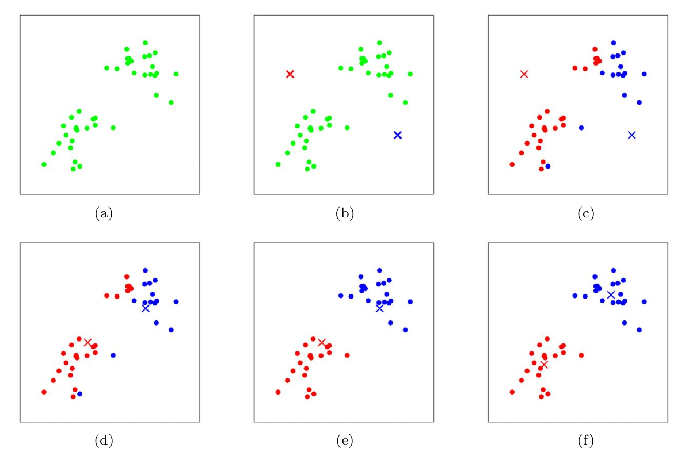

#  Standford CS229 2022Fall，第11讲：K-Means

## k-means 聚类算法

在聚类问题中，我们被给定一个训练集$\{x^{(1)}, \ldots, x^{(m)}\}$，并希望将数据分组为几个凝聚的"簇"。这里，$x^{(i)} \in \mathbb{R}^n$（如常）；但没有给出标签$y^{(i)}$。因此，这是一个无监督学习问题。

k-means聚类算法如下：
1. 随机初始化聚类中心$\mu_1, \mu_2, \ldots, \mu_k \in \mathbb{R}^n$。
2. 重复直到收敛：
   $$
   \begin{aligned}
   &\text{对于每个 } i, \text{ 设置 } c^{(i)} := \arg\min_j \|x^{(i)} - \mu_j\|^2 \\
   &\text{对于每个 } j, \text{ 设置 } \mu_j := \frac{\sum_{i=1}^m \mathbb{1}\{c^{(i)}=j\}x^{(i)}}{\sum_{i=1}^m \mathbb{1}\{c^{(i)}=j\}}
   \end{aligned}
   $$

在上述算法中，$k$（算法的一个参数）是我们想要找到的簇的数量；而聚类中心$\mu_j$代表我们对簇中心位置的当前猜测。为了初始化聚类中心（在上述算法的第1步中），我们可以随机选择$k$个训练示例，并将聚类中心设置为这些$k$个示例的值。（也可以使用其他初始化方法。）算法的内循环反复执行两个步骤：(i) "将"每个训练示例$x^{(i)}$分配给最近的聚类中心$\mu_j$，以及 (ii) 将每个聚类中心$\mu_j$移动到分配给它的点的均值。

图1展示了k-means的运行示例。
> 
> 图1：k-means算法。训练示例显示为点，聚类中心显示为叉号。(a) 原始数据集。(b) 随机初始聚类中心（在这个例子中，未选择为两个训练示例的值）。(c-f) 运行两轮k-means的示例。在每一轮迭代中，我们将每个训练示例分配给最近的聚类中心（通过"将"训练示例涂成与分配给它的聚类中心相同颜色来表示）；然后我们将每个聚类中心移动到分配给它的点的均值。（建议使用彩色查看。）图片由Michael Jordan提供。

k-means算法是否保证收敛？从某种意义上来说，是的。特别地，让我们定义失真函数为：
$$
J(c, \mu) = \sum_{i=1}^m \|x^{(i)} - \mu_{c^{(i)}}\|^2
$$
因此，$J$测量了每个训练示例$x^{(i)}$与其被分配的聚类中心$\mu_{c^{(i)}}$之间的平方距离之和。可以证明，k-means恰好是$J$的坐标下降。具体来说，k-means的内循环反复在固定$\mu$的情况下最小化$J$关于$c$，然后在固定$c$的情况下最小化$J$关于$\mu$。因此，$J$必须单调递减，$J$的值必须收敛。（通常，这也意味着$c$和$\mu$也会收敛。理论上，k-means可能在几个不同的聚类之间振荡——即$c$和/或$\mu$的几个不同值——这些值具有完全相同的$J$值，但在实践中这种情况几乎不会发生。）

失真函数$J$是一个非凸函数，因此$J$上的坐标下降不能保证收敛到全局最小值。换句话说，k-means可能陷入局部最优解。尽管如此，k-means通常工作良好并能产生非常好的聚类结果。但是，如果您担心陷入糟糕的局部最小值，一个常见的做法是多次运行k-means（使用不同的随机初始值作为聚类中心$\mu_j$）。然后，从找到的所有不同聚类中，选择给出最低失真$J(c, \mu)$的那个。