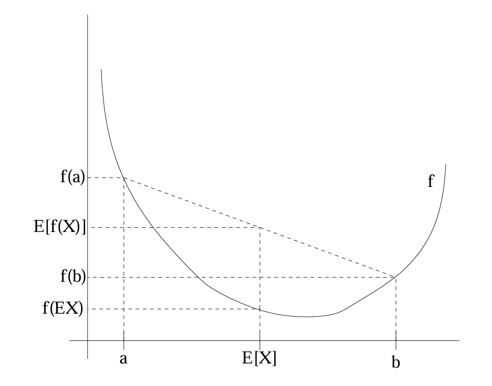
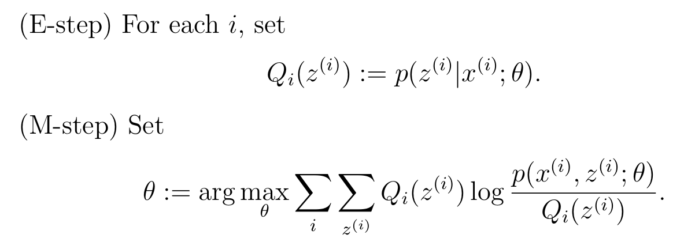

#  Standford CS229 2022Fall，第12.2讲：EM算法

## 回顾

在上一组讲义中，我们讨论了应用于高斯混合模型拟合的EM算法。在本组讲义中，我们将给出EM算法更广泛的视角，并展示它如何应用于一大类具有潜在变量的估计问题。我们从一个非常有用的结果——Jensen不等式开始讨论。

## 1 Jensen不等式

设 $f$ 是一个定义域为实数集的函数。回忆一下，如果对所有 $x \in \mathbb{R}$ 都有 $f''(x) \geq 0$，则称 $f$ 是凸函数。当 $f$ 的输入是向量时，这个条件推广为它的Hessian矩阵 $H$ 是半正定的（$H \geq 0$）。如果对所有 $x$ 都有 $f''(x) > 0$，则称 $f$ 是严格凸函数（在向量值情况下，相应的陈述是 $H$ 必须是正定的，记作 $H > 0$）。那么Jensen不等式可以表述如下：

**定理**。设 $f$ 是一个凸函数，$X$ 是一个随机变量。那么：
$$
\mathbb{E}[f(X)] \geq f(\mathbb{E}[X]).
$$
此外，如果 $f$ 是严格凸的，则 $\mathbb{E}[f(X)] = f(\mathbb{E}[X])$ 成立当且仅当 $X = \mathbb{E}[X]$ 以概率1成立（即，$X$ 是一个常数）。

回忆我们的惯例，有时在写期望时会省略括号，因此在上述定理中，$f(\mathbb{E}X) = f(\mathbb{E}[X])$。

为了理解这个定理，考虑下面的图。

这里，$f$ 是由实线表示的凸函数。同时，$X$ 是一个随机变量，有0.5的概率取值为 $a$，有0.5的概率取值为 $b$（在x轴上标出）。因此，$X$ 的期望值是 $a$ 和 $b$ 之间的中点。

我们还在y轴上标出了 $f(a)$、$f(b)$ 和 $f(\mathbb{E}[X])$ 的值。此外，$\mathbb{E}[f(X)]$ 现在是y轴上 $f(a)$ 和 $f(b)$ 之间的中点。从我们的例子中可以看出，因为 $f$ 是凸的，所以必须有 $\mathbb{E}[f(X)] \geq f(\mathbb{E}[X])$。

顺便说一句，很多人很难记住不等式的方向，记住像这样的图是一个快速找出答案的好方法。

**备注**。回忆一下，$f$ 是[严格]凹函数当且仅当 $-f$ 是[严格]凸函数（即，$f''(x) \leq 0$ 或 $H \leq 0$）。Jensen不等式也适用于凹函数 $f$，但所有不等式的方向都反过来（$\mathbb{E}[f(X)] \leq f(\mathbb{E}[X])$ 等）。

## 2 EM算法

假设我们有一个估计问题，其中我们有一个训练集 $\{x^{(1)}, ..., x^{(m)}\}$，包含 $m$ 个独立的样本。我们希望将模型 $p(x, z)$ 的参数 $\theta$ 拟合到数据中，其似然函数为
$$
\ell(\theta) = \sum_{i=1}^{m} \log p(x^{(i)}; \theta) = \sum_{i=1}^{m} \log \sum_{z} p(x^{(i)}, z^{(i)}; \theta).
$$
但是，显式地找到参数 $\theta$ 的最大似然估计可能很困难。在这里，$z^{(i)}$ 是潜在的随机变量；通常情况下，如果 $z^{(i)}$ 被观测到，那么最大似然估计就很容易了。

在这种设置下，EM算法提供了一种高效的最大似然估计方法。直接最大化 $\ell(\theta)$ 可能很困难，我们的策略是反复构建 $\ell(\theta)$ 的下界（E步），然后优化这个下界（M步）。

对于每个 $i$，令 $Q_i$ 是关于 $z$ 的某个分布（$\sum_z Q_i(z) = 1$, $Q_i(z) \geq 0$）。考虑以下推导：
$$
\begin{aligned}
\sum_i \log p(x^{(i)}; \theta) &= \sum_i \log \sum_{z^{(i)}} p(x^{(i)}, z^{(i)}; \theta) \quad (1) \\
&= \sum_i \log \sum_{z^{(i)}} Q_i(z^{(i)}) \frac{p(x^{(i)}, z^{(i)}; \theta)}{Q_i(z^{(i)})} \quad (2) \\
&\geq \sum_i \sum_{z^{(i)}} Q_i(z^{(i)}) \log \frac{p(x^{(i)}, z^{(i)}; \theta)}{Q_i(z^{(i)})} \quad (3)
\end{aligned}
$$
推导的最后一步使用了Jensen不等式。具体来说，$f(x) = \log x$ 是一个凹函数，因为在其定义域 $x \in \mathbb{R}^+$ 上，$f''(x) = -1/x^2 < 0$。另外，求和中的项
$$
\sum_{z^{(i)}} Q_i(z^{(i)}) \left[\frac{p(x^{(i)}, z^{(i)}; \theta)}{Q_i(z^{(i)})}\right]
$$
只是关于根据分布 $Q_i$ 抽取的 $z^{(i)}$ 的量 $[p(x^{(i)}, z^{(i)}; \theta)/Q_i(z^{(i)})]$ 的期望。根据Jensen不等式，我们有
$$
f(\mathbb{E}_{z^{(i)} \sim Q_i}[\frac{p(x^{(i)}, z^{(i)}; \theta)}{Q_i(z^{(i)})}]) \geq \mathbb{E}_{z^{(i)} \sim Q_i}[f(\frac{p(x^{(i)}, z^{(i)}; \theta)}{Q_i(z^{(i)})})],
$$
其中“$z^{(i)} \sim Q_i$”下标表示期望是相对于根据 $Q_i$ 抽取的 $z^{(i)}$ 来计算的。这使我们能够从公式(2)得到公式(3)。

现在，对于任何一组分布 $Q_i$，公式(3)给出了 $\ell(\theta)$ 的一个下界。有许多可能的 $Q_i$ 选择。我们应该选择哪一个？嗯，如果我们当前对参数 $\theta$ 有一个猜测，自然的想法是让下界在该 $\theta$ 值处紧致。也就是说，我们将在特定的 $\theta$ 值处使上述不等式取等号。（我们稍后会看到，这使我们能够证明随着EM迭代的进行，$\ell(\theta)$ 单调增加。）

为了在特定的 $\theta$ 值处使边界紧致，我们需要在上面推导中涉及Jensen不等式的步骤取等号。要使此成立，我们知道充分条件是期望是在一个“常数”值的随机变量上取的。也就是说，我们需要
$$
\frac{p(x^{(i)}, z^{(i)}; \theta)}{Q_i(z^{(i)})} = c
$$
对于某个与 $z^{(i)}$ 无关的常数 $c$。通过选择 $Q_i(z^{(i)}) \propto p(x^{(i)}, z^{(i)}; \theta)$ 很容易实现这一点。

实际上，由于我们知道 $\sum_z Q_i(z^{(i)}) = 1$（因为它是一个分布），这进一步告诉我们
$$
Q_i(z^{(i)}) = \frac{p(x^{(i)}, z^{(i)}; \theta)}{\sum_z p(x^{(i)}, z; \theta)} = \frac{p(x^{(i)}, z^{(i)}; \theta)}{p(x^{(i)}; \theta)} = p(z^{(i)} | x^{(i)}; \theta)
$$
因此，我们只需将 $Q_i$ 设置为给定 $x^{(i)}$ 和参数 $\theta$ 设置下 $z^{(i)}$ 的后验分布。

现在，对于这个 $Q_i$ 的选择，公式(3)给出了我们试图最大化的对数似然 $\ell$ 的一个下界。这是E步。在算法的M步中，我们然后相对于参数最大化公式(3)中的表达式，以获得新的 $\theta$ 设置。重复执行这两个步骤就得到了EM算法，如下所示：

重复直到收敛 {
    
}

我们如何知道这个算法是否会收敛？嗯，假设 $\theta^{(t)}$ 和 $\theta^{(t+1)}$ 是EM两次连续迭代的参数。我们现在将证明 $\ell(\theta^{(t)}) \leq \ell(\theta^{(t+1)})$，这表明EM总是单调地提高对数似然。证明这一结果的关键在于我们对 $Q_i$ 的选择。具体来说，在EM迭代中，当参数最初为 $\theta^{(t)}$ 时，我们会选择 $Q_i^{(t)}(z^{(i)}) := p(z^{(i)} | x^{(i)}; \theta^{(t)})$。我们之前已经看到，这种选择确保了应用Jensen不等式得到公式(3)时取等号，因此
$$
\ell(\theta^{(t)}) = \sum_i \sum_{z^{(i)}} Q_i^{(t)}(z^{(i)}) \log \frac{p(x^{(i)}, z^{(i)}; \theta^{(t)})}{Q_i^{(t)}(z^{(i)})}.
$$
然后，参数 $\theta^{(t+1)}$ 是通过最大化上述等式的右边得到的。因此，
$$
\ell(\theta^{(t+1)}) \geq \sum_i \sum_{z^{(i)}} Q_i^{(t)}(z^{(i)}) \log \frac{p(x^{(i)}, z^{(i)}; \theta^{(t+1)})}{Q_i^{(t)}(z^{(i)})} \quad (4) \\
\geq \sum_i \sum_{z^{(i)}} Q_i^{(t)}(z^{(i)}) \log \frac{p(x^{(i)}, z^{(i)}; \theta^{(t)})}{Q_i^{(t)}(z^{(i)})} \quad (5) \\
= \ell(\theta^{(t)}) \quad (6)
$$
第一个不等式来自于以下事实：对于任何 $Q_i$ 和 $\theta$ 的值，都有
$$
\ell(\theta) \geq \sum_i \sum_{z^{(i)}} Q_i(z^{(i)}) \log \frac{p(x^{(i)}, z^{(i)}; \theta)}{Q_i(z^{(i)})}
$$
特别地，当 $Q_i = Q_i^{(t)}$，$\theta = \theta^{(t+1)}$ 时也成立。为了得到公式(5)，我们利用了 $\theta^{(t+1)}$ 是明确选择来最大化以下公式的事实：
$$
\arg \max_\theta \sum_i \sum_{z^{(i)}} Q_i(z^{(i)}) \log \frac{p(x^{(i)}, z^{(i)}; \theta)}{Q_i(z^{(i)})}
$$
因此，该公式在 $\theta^{(t+1)}$ 处的值必须等于或大于在 $\theta^{(t)}$ 处的值。最后，得到(6)的步骤我们之前已经展示过，它源于 $Q_i^{(t)}$ 的选择使得Jensen不等式在 $\theta^{(t)}$ 处取等号。

因此，EM导致似然函数单调收敛。在我们对EM算法的描述中，我们说我们会运行它直到收敛。鉴于我们刚刚展示的结果，一个合理的收敛测试是检查连续迭代之间 $\ell(\theta)$ 的增加量是否小于某个容差参数，如果EM改善 $\ell(\theta)$ 的速度太慢，则声明收敛。

**备注**。如果我们定义
$$
J(Q, \theta) = \sum_i \sum_{z^{(i)}} Q_i(z^{(i)}) \log \frac{p(x^{(i)}, z^{(i)}; \theta)}{Q_i(z^{(i)})}
$$
那么我们知道 $\ell(\theta) \geq J(Q, \theta)$ 来自我们之前的推导。EM也可以被看作是在 $J$ 上的坐标上升法，其中E步相对于 $Q$ 最大化它（你自己验证一下），M步相对于 $\theta$ 最大化它。

## 3 再谈高斯混合模型

掌握了EM算法的一般定义后，让我们回到我们之前的例子，即拟合高斯混合模型中的参数 $\phi$、$\mu$ 和 $\Sigma$。

为了简洁起见，我们只对 $\phi$ 和 $\mu_j$ 的M步更新进行推导，而将 $\Sigma_j$ 的更新留给读者作为练习。

E步很简单。根据我们上面的算法推导，我们只需计算
$$
w_j^{(i)} = Q_i(z^{(i)} = j) = P(z^{(i)} = j | x^{(i)}; \phi, \mu, \Sigma).
$$
这里，“$Q_i(z^{(i)} = j)$”表示在分布 $Q_i$ 下 $z^{(i)}$ 取值为 $j$ 的概率。

接下来，在M步中，我们需要相对于我们的参数 $\phi$、$\mu$、$\Sigma$ 最大化以下数量：
$$
\begin{aligned}
&\sum_{i=1}^{m} \sum_{z^{(i)}} Q_i(z^{(i)}) \log \frac{p(x^{(i)}, z^{(i)}; \phi, \mu, \Sigma)}{Q_i(z^{(i)})} \\
&= \sum_{i=1}^{m} \sum_{j=1}^{k} Q_i(z^{(i)} = j) \log \frac{p(x^{(i)} | z^{(i)} = j; \mu, \Sigma) p(z^{(i)} = j; \phi)}{Q_i(z^{(i)} = j)} \\
&= \sum_{i=1}^{m} \sum_{j=1}^{k} w_j^{(i)} \log \frac{\frac{1}{(2\pi)^{d/2} |\Sigma_j|^{1/2}} \exp(-\frac{1}{2}(x^{(i)} - \mu_j)^T \Sigma_j^{-1} (x^{(i)} - \mu_j)) \cdot \phi_j}{w_j^{(i)}}
\end{aligned}
$$
让我们用 $\mu_l$ 来最大化这个表达式。如果我们对 $\mu_l$ 求导，我们发现
$$
\begin{aligned}
\nabla_{\mu_l} &\sum_{i=1}^{m} \sum_{j=1}^{k} w_j^{(i)} \log \frac{\frac{1}{(2\pi)^{d/2} |\Sigma_j|^{1/2}} \exp(-\frac{1}{2}(x^{(i)} - \mu_j)^T \Sigma_j^{-1} (x^{(i)} - \mu_j)) \cdot \phi_j}{w_j^{(i)}} \\
&= -\nabla_{\mu_l} \sum_{i=1}^{m} \sum_{j=1}^{k} w_j^{(i)} \frac{1}{2}(x^{(i)} - \mu_j)^T \Sigma_j^{-1} (x^{(i)} - \mu_j) \\
&= \frac{1}{2} \sum_{i=1}^{m} w_l^{(i)} \nabla_{\mu_l} [2\mu_l^T \Sigma_l^{-1} x^{(i)} - \mu_l^T \Sigma_l^{-1} \mu_l] \\
&= \sum_{i=1}^{m} w_l^{(i)} (\Sigma_l^{-1} x^{(i)} - \Sigma_l^{-1} \mu_l)
\end{aligned}
$$
将其设为零并求解 $\mu_l$，因此得到更新规则
$$
\mu_l := \frac{\sum_{i=1}^{m} w_l^{(i)} x^{(i)}}{\sum_{i=1}^{m} w_l^{(i)}},
$$
这正是我们在上一组讲义中得到的结果。

让我们再做一个例子，推导参数 $\phi_j$ 的M步更新。将仅依赖于 $\phi_j$ 的项组合在一起，我们发现我们需要最大化
$$
\sum_{i=1}^{m} \sum_{j=1}^{k} w_j^{(i)} \log \phi_j.
$$
然而，还有一个额外的约束，即 $\phi_j$ 的和为1，因为它们代表概率 $\phi_j = p(z^{(i)} = j; \phi)$。为了处理约束 $\sum_{j=1}^{k} \phi_j = 1$，我们构造拉格朗日函数
$$
\mathcal{L}(\phi) = \sum_{i=1}^{m} \sum_{j=1}^{k} w_j^{(i)} \log \phi_j + \beta \left( \sum_{j=1}^{k} \phi_j - 1 \right),
$$
其中 $\beta$ 是拉格朗日乘子。求导，我们发现
$$
\frac{\partial}{\partial \phi_j} \mathcal{L}(\phi) = \sum_{i=1}^{m} \frac{w_j^{(i)}}{\phi_j} + \beta
$$
将其设为零并求解，我们得到
$$
\phi_j = \frac{\sum_{i=1}^{m} w_j^{(i)}}{-\beta}
$$
也就是说，$\phi_j \propto \sum_{i=1}^{m} w_j^{(i)}$。利用约束 $\sum_j \phi_j = 1$，我们很容易发现 $-\beta = \sum_{i=1}^{m} \sum_{j=1}^{k} w_j^{(i)} = \sum_{i=1}^{m} 1 = m$。（这用到了 $w_j^{(i)} = Q_i(z^{(i)} = j)$，并且由于概率之和为1，$\sum_j w_j^{(i)} = 1$。）因此，我们得到了参数 $\phi_j$ 的M步更新：
$$
\phi_j := \frac{1}{m} \sum_{i=1}^{m} w_j^{(i)}.
$$
对 $\Sigma_j$ 的M步更新的推导同样非常直接。

**注释2**: 我们不需要担心 $\phi_j \geq 0$ 的约束，因为正如我们很快就会看到的，从这个推导中得出的解会自动满足这一点。