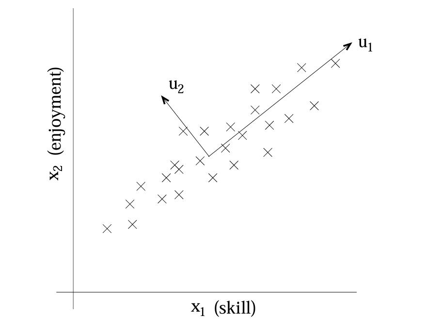
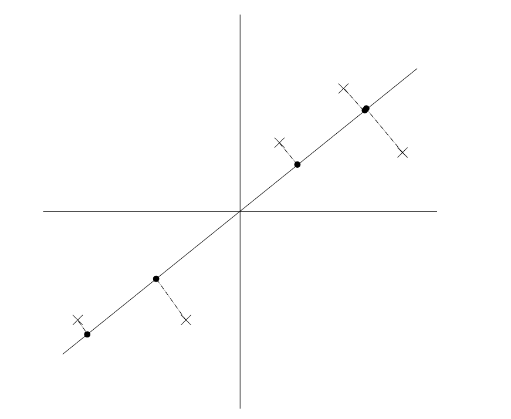

#  Standford CS229 2022Fall，第14讲：PCA

## 主成分分析

在我们讨论因子分析时，我们提供了一种方法来建模数据 $x \in \mathbb{R}^d$，使其“近似”位于某个 $k$ 维子空间中，其中 $k \ll d$。具体来说，我们想象每个点 $x^{(i)}$ 是通过首先生成一些位于 $k$ 维仿射空间 $\{\Lambda z + \mu; z \in \mathbb{R}^k\}$ 中的 $z^{(i)}$，然后添加协方差为 $\Psi$ 的噪声而创建的。因子分析基于概率模型，参数估计使用迭代的 EM 算法。

在本组笔记中，我们将开发一种称为主成分分析（PCA）的方法，它也试图识别数据近似所在的子空间。然而，PCA 将更直接地实现这一点，并且只需要进行特征向量计算（在 Matlab 中使用 `eig` 函数即可轻松完成），而无需借助 EM 算法。

假设我们得到了一个包含 $n$ 种不同类型汽车属性的数据集 $\{x^{(i)}; i=1,...,n\}$，例如它们的最大速度、转弯半径等。对于每个 $i$，令 $x^{(i)} \in \mathbb{R}^d$（$d \ll n$）。但我们不知道的是，有两个不同的属性——某些 $x_i$ 和 $x_j$——分别给出了汽车以英里/小时和公里/小时为单位测量的最大速度。因此，这两个属性几乎是线性相关的，仅存在由四舍五入到最接近的 mph 或 kph 引入的微小差异。

因此，数据实际上近似位于一个 $n-1$ 维子空间中。
我们如何自动检测并可能消除这种冗余？

举一个不那么人为的例子，考虑一个来自遥控直升机飞行员调查的数据集，其中 $x^{(i)}_1$ 衡量了飞行员 $i$ 的驾驶技能，而 $x^{(i)}_2$ 捕捉了他/她对飞行的喜爱程度。由于遥控直升机非常难飞，只有那些最有奉献精神、真正喜欢飞行的学生才能成为优秀的飞行员。因此，这两个属性 $x_1$ 和 $x_2$ 高度相关。事实上，我们可能会假设数据实际上沿着某个对角轴（$u_1$ 方向）分布，该轴捕捉了一个人固有的驾驶“业力”，只有少量噪声偏离该轴。（见图。）我们如何自动计算这个 $u_1$ 方向？

我们很快将开发 PCA 算法。但在运行 PCA 本身之前，通常我们首先通过对每个特征进行归一化处理，使其均值为 0，方差为 1。我们通过减去均值并除以经验标准差来实现：

$$
x^{(i)}_j \leftarrow \frac{x^{(i)}_j - \mu_j}{\sigma_j}
$$

其中 $\mu_j = \frac{1}{n} \sum_{i=1}^n x^{(i)}_j$ 和 $\sigma^2_j = \frac{1}{n} \sum_{i=1}^n (x^{(i)}_j - \mu_j)^2$ 分别是特征 $j$ 的均值和方差。

减去 $\mu_j$ 可使均值为零，对于已知均值为零的数据（例如，对应于语音或其他声学信号的时间序列）可以省略此步骤。除以标准差 $\sigma_j$ 会重新缩放每个坐标，使其具有单位方差，这确保了不同属性都在相同的“尺度”上被处理。例如，如果 $x_1$ 是汽车的最大速度（以 mph 为单位，取值在几十或上百），而 $x_2$ 是座位数（取值在 2-4 左右），那么这种重缩放会使不同的属性更具可比性。如果我们先验地知道所有属性都在同一尺度上，则可以省略此重缩放。一个例子是，如果每个数据点代表一张灰度图像，且每个 $x^{(i)}_j$ 取值于 $\{0, 1, ..., 255\}$，对应于图像 $i$ 中像素 $j$ 的强度值。

现在，在对数据进行归一化后，我们如何计算“主要变化轴” $u$——即数据近似所在的直线方向？

一种方法是将此问题表述为寻找单位向量 $u$，使得当数据投影到与 $u$ 对应的方向上时，投影数据的方差最大化。直观上，数据最初具有一定的方差/信息量。我们希望选择一个方向 $u$，使得如果我们近似地将数据视为位于与 $u$ 对应的方向/子空间上，尽可能多地保留这些方差。

考虑以下数据集，我们已经完成了归一化步骤：

现在，假设我们选择 $u$ 对应于下图所示的方向。圆圈表示原始数据在该直线上的投影。

我们看到投影数据仍然具有相当大的方差，点倾向于远离零点。相比之下，假设我们选择了以下方向：

在这里，投影的方差显著减小，并且更接近原点。

我们希望自动选择与上面第一个图所示相对应的方向 $u$。为了形式化这一点，请注意，给定一个单位向量 $u$ 和一个点 $x$，$x$ 在 $u$ 上的投影长度由 $x^T u$ 给出。也就是说，如果 $x^{(i)}$ 是我们数据集中的一个点（图中的一个叉号），那么它在 $u$ 上的投影（图中对应的圆圈）距离原点的距离为 $x^T u$。因此，为了最大化投影的方差，我们希望选择一个单位长度的 $u$，以最大化：

$$
\frac{1}{n} \sum_{i=1}^n (x^{(i)T} u)^2 = \frac{1}{n} \sum_{i=1}^n u^T x^{(i)} x^{(i)T} u = u^T \left( \frac{1}{n} \sum_{i=1}^n x^{(i)} x^{(i)T} \right) u.
$$

我们很容易认识到，最大化这个表达式并满足 $\|u\|_2 = 1$ 的条件，得到的是 $\Sigma = \frac{1}{n} \sum_{i=1}^n x^{(i)} x^{(i)T}$ 的主特征向量，这正是数据的经验协方差矩阵（假设其均值为零）。¹

总结一下，我们发现，如果我们希望找到一个一维子空间来近似数据，我们应该选择 $u$ 作为 $\Sigma$ 的主特征向量。更一般地，如果我们希望将数据投影到一个 $k$ 维子空间（$k < d$）中，我们应该选择 $u_1, ..., u_k$ 作为 $\Sigma$ 的前 $k$ 个特征向量。这些 $u_i$ 现在构成了数据的一个新的正交基。²

然后，为了用这个基表示 $x^{(i)}$，我们只需要计算相应的向量

$$
y^{(i)} = \begin{bmatrix} u_1^T x^{(i)} \\ u_2^T x^{(i)} \\ ... \\ u_k^T x^{(i)} \end{bmatrix} \in \mathbb{R}^k.
$$

因此，虽然 $x^{(i)} \in \mathbb{R}^d$，但向量 $y^{(i)}$ 现在给出了 $x^{(i)}$ 的一个更低维度（$k$ 维）的近似/表示。因此，PCA 也被称为降维算法。向量 $u_1, ..., u_k$ 被称为数据的前 $k$ 个主成分。

备注。虽然我们只在 $k=1$ 的情况下进行了正式证明，但利用众所周知的特征向量性质，很容易证明在所有可能的正交基 $u_1, ..., u_k$ 中，我们所选择的基最大化 $\sum_i \|y^{(i)}\|_2^2$。因此，我们选择的基保留了原始数据中尽可能多的变异性。

在作业 4 中，您将看到 PCA 也可以通过选择最小化将数据投影到由它们张成的 $k$ 维子空间上所产生的近似误差的基来推导。

PCA 有许多应用；我们将以几个例子结束我们的讨论。首先，压缩——用较低维度的 $y^{(i)}$ 表示 $x^{(i)}$——是一个显而易见的应用。如果我们把高维数据降低到 $k=2$ 或 $3$ 维，那么我们也可以绘制 $y^{(i)}$ 来可视化数据。例如，如果我们把汽车数据降到二维，那么我们可以绘制它（图中的一个点对应一种汽车类型），看看哪些汽车彼此相似，以及哪些汽车群体会聚集在一起。

另一个标准应用是在运行监督学习算法之前对数据集进行预处理以降低其维度，其中 $x^{(i)}$ 作为输入。除了计算上的好处外，降低数据的维度还可以减少所考虑的假设类的复杂性，并有助于避免过拟合（例如，低维输入空间上的线性分类器将具有更小的 VC 维度）。

最后，正如在我们的 RC 飞行员例子中一样，我们也可以将 PCA 视为一种降噪算法。在我们的例子中，它从驾驶技能和喜爱程度的噪声测量中估计了内在的“驾驶业力”。在课堂上，我们还看到了这一思想应用于人脸图像，从而产生了特征脸方法。在这里，每个点 $x^{(i)} \in \mathbb{R}^{100 \times 100}$ 是一个 10000 维的向量，每个坐标对应于一张 100x100 人脸图像中像素的强度值。使用 PCA，我们用一个低得多维度的 $y^{(i)}$ 表示每张图像 $x^{(i)}$。这样做时，我们希望找到的主成分能够保留人脸之间有趣的、系统性的变化，这些变化捕捉了一个人真正的相貌，但不会保留由轻微光照变化、略微不同的成像条件等引入的图像“噪声”。

然后，我们通过在降维空间中工作并计算 $\|y^{(i)} - y^{(j)}\|_2$ 来衡量人脸 $i$ 和 $j$ 之间的距离。这产生了一个令人惊讶的良好的人脸匹配和检索算法。

---

¹ 如果你以前没有见过这个，尝试使用拉格朗日乘数法来最大化 $u^T \Sigma u$，约束条件是 $u^T u = 1$。你应该能够证明 $\Sigma u = \lambda u$，对于某个 $\lambda$，这意味着 $u$ 是 $\Sigma$ 的特征向量，特征值为 $\lambda$。

² 因为 $\Sigma$ 是对称的，所以 $u_i$ 总是可以（或总是可以选择）相互正交。