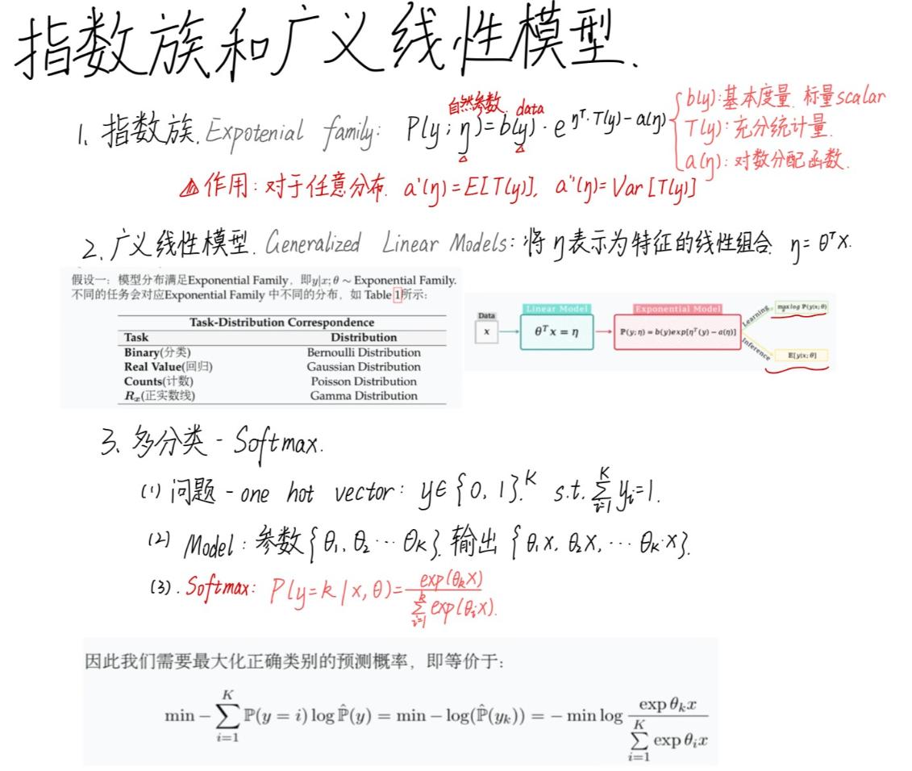
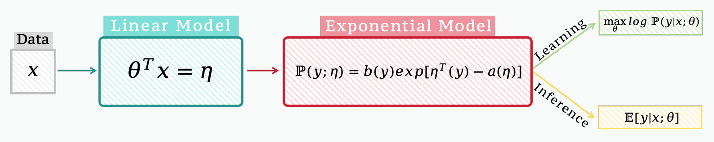
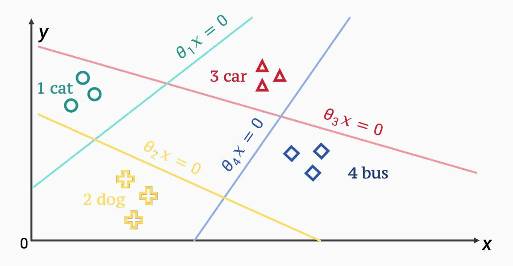
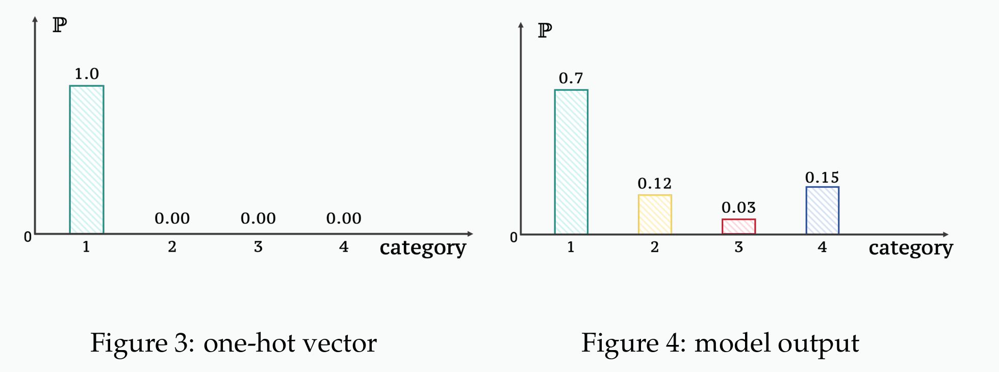

# Standford CS229 2022Fall，第3讲：指数族与广义线性模型

## 思维导图

---

## 指数族 (Exponential Family)

### 引言

指数族这一概念在历史上曾经很重要。虽然这并不是目前最先进的模型，但其中的思想依然值得学习。其核心思想是将概率密度函数 (probability density function, p.d.f.) 写成一个统一的形式，从而将多种常见分布的密度函数直接作为其特殊情形下的推论。

指数族模型是将概率密度函数写为如下数学形式：
$$ P(y; \eta) = b(y) \exp[\eta^T T(y) - a(\eta)] \quad (1) $$
其中 $y$ 为数据 (data)，$\eta$ 为自然参数 (natural parameters)，
1.  $b(y)$ 称为基本度量 (base measure)，其与 $\eta$ 无关，为标量 (scalar)。
2.  $T(y)$ 称为充分统计量 (sufficient statistics)，其在捕捉与数据 $y$ 有关的信息。事实上后续会设定 $T(y)= y$，$T(y)$ 是与 $\eta$ 的维数相同的向量。
3.  $a(\eta)$ 被称为对数分配函数 (log partition function)，其与数据 $y$ 无关，为标量。
    > 尽管我们对 $P(y; \eta)$ 要求作用于 $y$ 后概率和为1，但是实际上与 $y$ 无关的 $a(\eta)$ 却是包含了整个 $P$ 信息的核心，可见 Theorem 1。

### Example 1 – 伯努利分布 (Bernoulli distribution)

对于一个伯努利分布，即0-1分布：
$$ P(y; \phi) = \phi^y(1 - \phi)^{(1-y)}, \quad y \in \{0, 1\} $$
其可以写为（推导详见A.1）：
$$ P(y; \phi) = \exp[\eta y - \log(e^\eta + 1)] \quad (2) $$
其中 $\eta = \log(\frac{\phi}{1-\phi})$，$T(y) = y$。并且神奇的是计算可得：
$$ a'(\eta) = \frac{e^\eta}{1 + e^\eta} = \frac{\phi}{1 - \phi} \times (1 - \phi) = \phi = E[T(y)] $$
$$ a''(\eta) = \left( \frac{e^\eta}{1 + e^\eta} \right)' = \frac{e^\eta}{(1 + e^\eta)^2} = \frac{\phi}{1 - \phi} \times (1 - \phi)^2 = \phi(1 - \phi) = Var(T(y)) $$

### Example 2 – 高斯分布 (Gaussian distribution)

对于一个高斯分布 $y \sim N(\mu, \sigma^2)$，其中均值 $\mu$ 需要预测，方差 $\sigma^2$ 固定：
$$ P(y; \mu) = \frac{1}{\sqrt{2\pi\sigma^2}} \exp\left[-\frac{(y - \mu)^2}{2\sigma^2}\right] $$
其可以写为（推导详见A.2）：
$$ P(y; \mu) = \frac{1}{\sqrt{2\pi\sigma^2}} \exp(-\frac{y^2}{2}) \exp\left[\eta \cdot (\frac{1}{\sigma^2} y) - \frac{1}{2\sigma^2} \eta^2\right] \quad (3) $$
其中 $\eta = \mu$，$T(y) = \frac{1}{\sigma^2} y$。

同样地计算可得：
$$ a'(\eta) = \frac{1}{\sigma^2} \mu = E[T(y)], \quad a''(\eta) = \frac{1}{\sigma^2} = Var(T(y)) $$

### 为什么使用指数族？

在 Lecture 3 中我们已经将回归、分类等问题使用概率的视角进行转化，实际上我们最后做的工作就是对某一个假设的概率的决定性参数进行估计，例如高斯分布我们需要估计均值（也可以同时估计方差）、0-1分布我们需要估计事件成功的概率。而将这些概率模型写成式 (1) 的形式后，我们事实上有：

**Theorem 1.** 将 $P(y; \eta)$ 写成指数族形式 $P(y; \eta) = b(y) \exp[\eta^T T(y) - a(\eta)]$ 后，有：
$$ a'(\eta) = E[T(y)], \quad a''(\eta) = Var(T(y)) $$
将式 (1) 对 $\eta$ 求二阶导发现 $P''(y; \eta) = -a'' = -Var(y) \leqslant 0$，因此使用此式定义损失函数后得到的是一个完全凹的优化问题（添上负号后当然等价于凸优化），求解是非常高效的。
> 证明见附录 A.3，且计算后发现结论与课程中的不匹配，课程中写的是 $E[y]$ 和 $Var(y)$。

---

## 广义线性模型 (Generalized Linear Models)

### 广义线性模型的假设

广义线性模型是将自然参数表示为特征的线性组合，即 $\eta = \theta^T x$，再将自然参数代入指数族计算概率分布，因此需要作出如下假设：

**假设一：** 模型分布满足指数族，即 $y|x; \theta \sim \text{Exponential Family}$。
不同的任务会对应指数族中不同的分布，如 Table 1 所示：

| 任务 (Task)          | 分布 (Distribution)       |
|----------------------|---------------------------|
| 二分类 (Binary)      | 伯努利分布 (Bernoulli)    |
| 实数值回归 (Real Value) | 高斯分布 (Gaussian)       |
| 计数 (Counts)        | 泊松分布 (Poisson)        |
| 正实数线 (R+)        | 伽马分布 (Gamma)          |

**Table 1: 任务-分布对应关系**

> **Note 1.** 我们已经看到指数族模型已经包括了很多种分布，因此这个假设比一般的如假设数据满足高斯分布等更具有一般性，但是由于指数族模型也并非囊括了所有的分布，所以也会引入模型误差。

**假设二：** 指数族的自然参数是特征的线性组合，即 $\eta = \theta^T x$, $\theta \in \mathbb{R}^{d+1}$, $x \in \mathbb{R}^{d+1}$。
> **Note 2.** 在低维情况下可能数据点并非是线性可分的，即可能并不存在超平面将两组数据点分开，但是在高维情形下，这一般是可以做到的。

**假设三：** 在测试即推理 (inference) 阶段，输出为 $E[y|x; \theta]$，即
$$ \eta_\theta(x) = E[y|x; \theta] \quad (4) $$

### 广义线性模型 (Generalized Linear Model)

广义线性模型首先将指数族的自然参数 $\eta$ 表示为特征的线性组合：
$$ \eta = \theta^T x \quad (5) $$
随后根据式 (1) 输出 $y$ 的概率分布。在学习 (Learning) 阶段，以最大化正确标签的概率：
$$ \max_\theta \log P(y | x; \theta) \quad (6) $$
其中参数优化的过程与前面几个 Lecture 中得到的一致，为：
$$ \theta_j := \theta_j + \alpha \sum_{i=1}^{N} (y^{(i)} - h_\theta(x^{(i)})) x_j^{(i)} \quad (7) $$
因此广义线性模型的示意图如图1所示。

> **Figure 1: Generalized Linear Model**

我们在 Lecture 2 中介绍概率模型时是先对分布进行假设后再对其中的参数进行估计和优化，例如二分类中使用伯努利分布，需要估计参数 $\phi$，在连续值回归预测中使用高斯分布，固定方差 $\sigma^2$ 后估计均值 $\mu$。我们称之前所假设的这些分布中的参数为 *canonical parameters*，与指数族中的 *natural parameter* $\eta$ 相对应。事实上我们可以通过映射 $g$ 将 $\eta$ 映射为 *canonical parameters*，同理也有逆映射 $g^{-1}$ 将 *canonical parameters* 映射为 $\eta$，并将映射 $g$ 称为 *canonical function/ canonical response/ link function*。

在逻辑回归 (Logistic Regression) 中（对应于 Example 1 – Bernoulli distribution），
$$ h_\theta(x) = E[y|x; \theta], \quad \phi = \frac{1}{1 + e^{-\eta}} = \frac{1}{1 + e^{-\theta^T x}} $$

在一般连续值回归中（对应于 Example 2 – Gaussian distribution），
$$ h_\theta(x) = E[y|x; \theta] = \mu = \theta^T x $$

> 注意由于 $\eta$ 由 $\theta$ 表示，因此 $P(y | x; \eta)$ 就是 $P(y | x; \theta)$。

---

## 多分类 (Multi Classification) via Softmax

### 多分类–编码 (Multi Classification–Encoding)

在 Lecture 3 中我们考虑了二分类任务，但是实际中多分类任务也是常见的。例如考虑一个四分类任务：区分 {cat, dog, car, bus} 这四类事物的图片。

为了将他们区分开，我们首先要为不同的类别配备可以完全区分的数值化表示——one-hot vector——对于 K 个类别，编码每个类别为一个 K 维向量：
$$ y \in \{0, 1\}^K, \quad \text{s.t.} \quad \sum_{i=1}^{K} y_i = 1 $$
因此这里我们可以将四种类别编码为：
- cat: $[1 \ 0 \ 0 \ 0]^T$
- dog: $[0 \ 1 \ 0 \ 0]^T$
- car: $[0 \ 0 \ 1 \ 0]^T$
- bus: $[0 \ 0 \ 0 \ 1]^T$

在进行了向量化编码之后，我们就可以在向量空间中考虑分类问题，如图 (2) 所示，对于类别 $i$，我们想要找到的是一个超平面 $\theta_i x = 0$ 使得该类别与其他类别尽量分开：
> **Figure 2: Multi Classification**
> 
> 此示意图是二维空间，但实际是四维；在真实情况下数据的分布很可能也没有图中这么聚集；我们的目的是使得只有第 $i$ 类的点满足 $\theta_i x > 0$。

### 多分类–概率 (Multi Classification–Probability)

正如 one-hot vector 所示，真实情况下四个维度只能由一个类别的概率为1（如图3），这个概率为1对应的类别当然就是其真实类别。但是这样的编码是一个离散型的，在我们在模型中常常不能实现只有一个类别概率为1其余为0，而是每个类别都有可能，但是有概率大小区别（如图4）。

在训练模型时我们实际得到的是参数 $\{\theta_1, \cdots, \theta_K\}$，因此对于数据 $x$，可以得到一系列的值 $\{\theta_1 x, \cdots, \theta_K x\}$。为了将其转化为概率，我们只需要做一步 softmax：
$$ P(y = k | x; \theta) = \frac{\exp(\theta_k x)}{\sum_{i=1}^{K} \exp(\theta_i x)} \quad (8) $$
因此我们需要最大化正确类别的预测概率，即等价于：
$$ \min -\sum_{i=1}^{K} P(y = i) \log \hat{P}(y) = \min -\log(\hat{P}(y_k)) = -\min \log \frac{\exp(\theta_k x)}{\sum_{i=1}^{K} \exp(\theta_i x)} \quad (9) $$

> **Note 3.** 在式 (8) 中我们只使用了 $x$ 作为特征进行计算，但是有时候仅使用他们是不够的。神经网络效果表现良好很大程度上的原因是其能够作为一个高效特征提取器，例如可以提取出 $x^2, \sqrt{x}$ 这样的非线性特征。

---

## A 证明 (Proof)

### A.1 Example 1 证明

**Proof of Example 1**

对于一个伯努利分布，即0-1分布：
$$ P(y; \phi) = \phi^y(1 - \phi)^{(1-y)}, \quad y \in \{0, 1\} $$
我们的目标是将其写为式 (1) 的形式，推导过程如下：
$$ P(y; \phi) = \phi^y(1 - \phi)^{(1-y)} = \exp[\log(\phi^y(1 - \phi)^{(1-y)})] = \exp[y \log \phi + (1 - y) \log(1 - \phi)] = \exp[y \log(\frac{\phi}{1 - \phi}) + \log(1 - \phi)] $$
因此令 $\eta = \log(\frac{\phi}{1-\phi})$, $T(y) = y$, $b(y) = 1$, $a(\eta) = -\log(1 - \phi)$。由于 $\exp \eta + 1 = \frac{1}{1 - \phi} = \exp a$，因此 $a(\eta) = \log(e^\eta + 1)$，故 $P(y; \phi)$ 可以写为：
$$ P(y; \phi) = \exp[\eta y - \log(e^\eta + 1)] $$
同时计算可得：
$$ a'(\eta) = \frac{e^\eta}{1 + e^\eta} = \frac{\phi}{1 - \phi} \times (1 - \phi) = \phi = E[T(y)] $$
$$ a''(\eta) = \left( \frac{e^\eta}{1 + e^\eta} \right)' = \frac{e^\eta}{(1 + e^\eta)^2} = \frac{\phi}{1 - \phi} \times (1 - \phi)^2 = \phi(1 - \phi) = Var(T(y)) $$

### A.2 Example 2 证明

**Proof of Example 1**

对于一个高斯分布 $y \sim N(\mu, \sigma^2)$，其中均值 $\mu$ 需要预测，方差 $\sigma^2$ 固定：
$$ P(y; \mu) = \frac{1}{\sqrt{2\pi\sigma^2}} \exp\left[-\frac{(y - \mu)^2}{2\sigma^2}\right] $$
我们的目标是将其写为式 (1) 的形式，推导过程如下：
$$ P(y; \mu) = \frac{1}{\sqrt{2\pi\sigma^2}} \exp\left[-\frac{y^2}{2\sigma^2} + \frac{y\mu}{\sigma^2} - \frac{\mu^2}{2\sigma^2}\right] = \frac{1}{\sqrt{2\pi\sigma^2}} \exp(-\frac{y^2}{2\sigma^2}) \exp\left[\mu \cdot (\frac{1}{\sigma^2} y) - \frac{1}{2\sigma^2} \mu^2\right] $$
因此令 $\eta = \mu$，$b(y) = \frac{1}{\sqrt{2\pi\sigma^2}} \exp(-\frac{y^2}{2\sigma^2})$，$T(y) = \frac{1}{\sigma^2} y$，$a(\eta) = \frac{1}{2\sigma^2} \mu^2 = \frac{1}{2\sigma^2} \eta^2$ 即可。

同样地计算可得：
$$ a'(\eta) = \frac{1}{\sigma^2} \mu = E[T(y)], \quad a''(\eta) = \frac{1}{\sigma^2} = Var(T(y)) $$

### A.3 Theorem 1 证明

**Proof of Theorem 1**

要证在 $P(y; \eta) = b(y) \exp[\eta^T T(y) - a(\eta)]$ 下 $a'(\eta) = E[T(y)]$, $a''(\eta) = Var(T(y))$。

式 (1) 等价地可以写为：
$$ P(y; \eta) = \frac{b(y) \exp[\eta^T T(y)]}{\exp a(\eta)} \quad (10) $$
由于概率和为1，因此：
$$ \exp a(\eta) = \sum_y b(y) \exp[\eta^T T(y)] \quad (11) $$
两边同时对 $\eta$ 求导，得：
$$ a'(\eta) \exp a(\eta) = \sum_y b(y) T(y) \exp[\eta^T T(y)] \quad (12) $$
即：
$$ a'(\eta) = \sum_y T(y) \frac{b(y) \exp[\eta^T T(y)]}{\exp a(\eta)} = \sum_y T(y) P(y; \eta) = E[T(y)] \quad (13) $$
同理对式 (12) 两边再同时对 $\eta$ 求导，得：
$$ [a''(\eta) + (a'(\eta))^2] \exp a(\eta) = \sum_y b(y) (T(y))^2 \exp[\eta^T T(y)] \quad (14) $$
即：
$$ a''(\eta) + (a'(\eta))^2 = \sum_y (T(y))^2 \frac{b(y) \exp[\eta^T T(y)]}{\exp a(\eta)} = \sum_y (T(y))^2 P(y; \eta) = E[(T(y))^2] \quad (15) $$
因此：
$$ a''(\eta) = E[(T(y))^2] - (E[T(y)])^2 = Var(T(y)) \quad (16) $$
