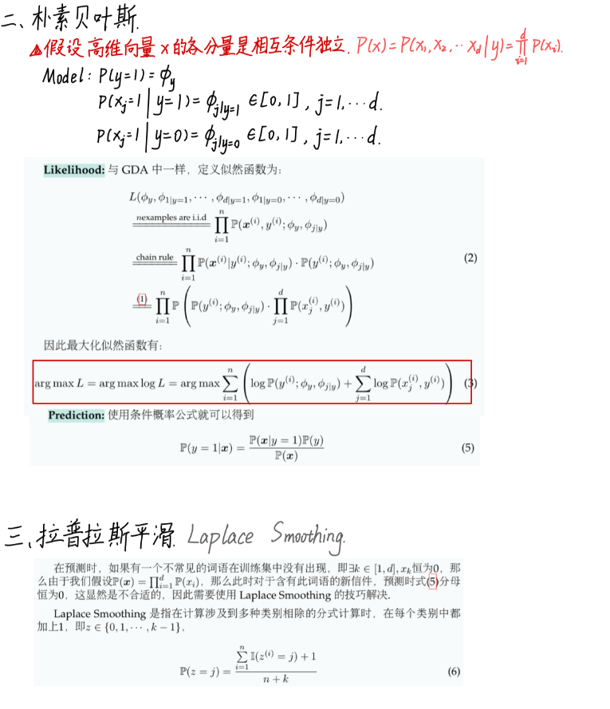
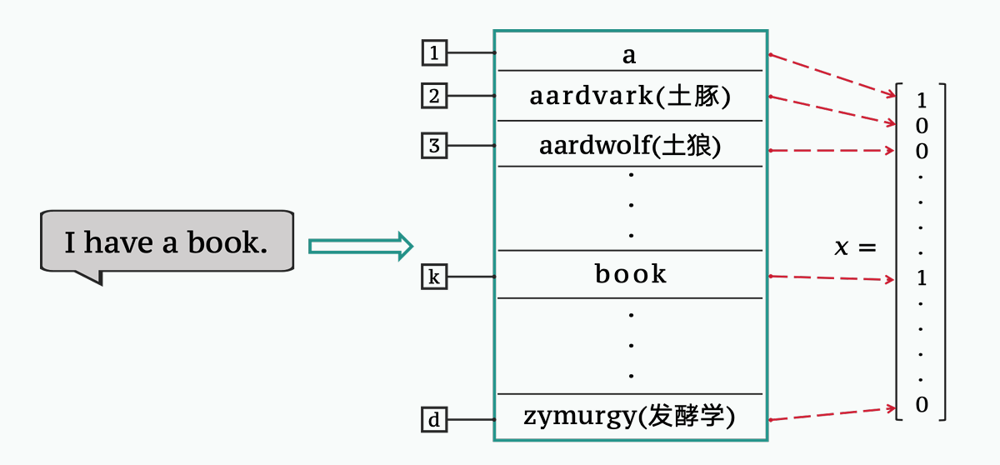

# Standford CS229 2022Fall，第5讲：朴素贝叶斯，拉普拉斯平滑

## 思维导图

## 引言

在 GDA（高斯判别分析）中，一个关键的假设是 $x|(y=i) \sim N(\mu_i, \Sigma)$。然而，当数据本身无法做出高斯性假设时（例如，完全是离散的数据），GDA 就无法使用了。下面介绍的朴素贝叶斯方法 (Naive Bayes) 仍然可以发挥作用。

## 朴素贝叶斯

### 朴素贝叶斯 – 以垃圾邮件分类为例

下面以邮箱中垃圾邮件分类为例，介绍 Naive Bayes 算法的假设和流程。

在垃圾邮件分类中，我们仍然做的是二分类，$y \in \{0, 1\}$，其中 $y=0$ 表示是垃圾邮件，是负例 (negative)，$y=1$ 表示不是垃圾邮件，是正例 (positive)。而将一封邮件记为 $x$。
> 
> **图 1: 垃圾邮件分类**

### 向量化

邮件的内容都是文本类型 (text) 的自然语言数据，要将其转化为机器可以“读懂的语言”，首先要进行向量化。下面介绍一种最简单的向量化操作。

假设已有一个包含足够多英文单词的有序词汇表 (Vocabulary)，其记录了 $d$ 个单词。对于一封邮件 $x$，若某个词语在此邮件中出现了，不管出现了多少次，都统一记录该位置的值为 1，否则为 0（如图 2）。因此 $x = (x_1, x_2, \cdots, x_d) \in \{0, 1\}^d$，且称向量化后的向量为特征向量 (feature vector)。可以看到这种向量化方式不考虑字符的顺序，也不考虑字符在一封信中出现的频率。
> 
> **图 2: I have a book.**

### 垃圾邮件分类 – 从建模到预测

#### 建模

与 GDA 相同，此时仍然需要对 $x|y$ 和 $y$ 进行建模，但是由于现在 $x \in \{0, 1\}^d$，其已不能再做高斯性的假设。在 Naive Bayes 中我们转而假设高维向量 $x$ 的各分量是相互条件独立的，即 $x_1|y, x_2|y, \cdots, x_d|y$ 是相互独立的：

$$
P(x) = P(x_1, x_2, \cdots, x_d | y) = \prod_{i=1}^{d} P(x_i)
$$

#### 模型参数

记正例条件下分量 $x_j=1$ 的概率为 $P(x_j=1|y=1) = \phi_{j|y=1} \in [0, 1], j=1, \cdots, d$

同理记负例条件下分量 $x_j=1$ 的概率为 $P(x_j=1|y=0) = \phi_{j|y=0} \in [0, 1], j=1, \cdots, d$

全部邮件中正例的概率为 $P(y=1) = \phi_y$.

#### 似然函数

与 GDA 中一样，定义似然函数为：

$$
L(\phi_y, \phi_{1|y=1}, \cdots, \phi_{d|y=1}, \phi_{1|y=0}, \cdots, \phi_{d|y=0}) \\
\overset{\text{n examples are i.i.d}}{=} \prod_{i=1}^{n} P(x^{(i)}, y^{(i)}; \phi_y, \phi_{j|y}) \\
\overset{\text{chain rule}}{=} \prod_{i=1}^{n} P(x^{(i)}|y^{(i)}; \phi_y, \phi_{j|y}) \cdot P(y^{(i)}; \phi_y, \phi_{j|y}) \\
\overset{(=1=)}{=} \prod_{i=1}^{n} P \left( P(y^{(i)}; \phi_y, \phi_{j|y}) \cdot \prod_{j=1}^{d} P(x^{(i)}_j, y^{(i)}) \right)
$$

因此最大化似然函数有：

$$
\arg \max L = \arg \max \log L = \arg \max \sum_{i=1}^{n} \left( \log P(y^{(i)}; \phi_y, \phi_{j|y}) + \sum_{j=1}^{d} \log P(x^{(i)}_j, y^{(i)}) \right)
$$

#### 解

令 $\nabla \ell(\phi_y, \phi_{j|y}) = 0$，最后得到：

$$
\phi_y = \frac{\sum_{i=1}^{n} I(y^{(i)}=1)}{n} : \text{正例样本的比例} \quad (4a)
$$

$$
\phi_{j|y=1} = \frac{\sum_{i=1}^{n} I(x^{(i)}_j=1, y^{(i)}=1)}{\sum_{i=1}^{n} I(y^{(i)}=1)} : \text{j-th 单词在正例中的比例} \quad (4b)
$$

$$
\phi_{j|y=0} = \frac{\sum_{i=1}^{n} I(x^{(i)}_j=0, y^{(i)}=1)}{\sum_{i=1}^{n} I(y^{(i)}=0)} : \text{j-th 单词在负例中的比例} \quad (4c)
$$

#### 预测

使用条件概率公式就可以得到：

$$
P(y=1|x) = \frac{P(x|y=1)P(y)}{P(x)}
$$

> **注**: 事实上这个假设现实中是不对的，因为我们的信件使用的自然语言一定有固定组合、逻辑等关系，不会都是条件独立的，但是实验表明这样假设在实际使用中效果已经很好了。

## 拉普拉斯平滑 (Laplace Smoothing)

### 拉普拉斯平滑

在预测时，如果有一个不常见的词语在训练集中没有出现，即 $\exists k \in [1, d]$, $x_k$ 恒为 0，那么由于我们假设 $P(x)=\prod_{i=1}^{d} P(x_i)$，那么此时对于含有此词语的新信件，预测时式 (5) 分母恒为 0，这显然是不合适的，因此需要使用 Laplace Smoothing 的技巧解决。

Laplace Smoothing 是指在计算涉及到多种类别相除的分式计算时，在每个类别中都加上 1，即 $z \in \{0, 1, \cdots, k-1\}$，

$$
P(z=j) = \frac{\sum_{i=1}^{n} I(z^{(i)}=j) + 1}{n + k}
$$

可以看到在使用了 Laplace Smoothing 后，我们学习到的参数在数据量小的时候不会特别极端，而在数据量大时，使用 Laplace Smoothing 对最终的结果影响也不大。

使用了 Laplace Smoothing 后，我们得到改进后的 Solution (4b)(4c) 为：

$$
\phi_{j|y=1} = \frac{\sum_{i=1}^{n} I(x^{(i)}_j=1, y^{(i)}=1) + 1}{\sum_{i=1}^{n} I(y^{(i)}=1) + 2} \quad (7a)
$$

$$
\phi_{j|y=0} = \frac{\sum_{i=1}^{n} I(x^{(i)}_j=0, y^{(i)}=1) + 1}{\sum_{i=1}^{n} I(y^{(i)}=0) + 2} \quad (7b)
$$
