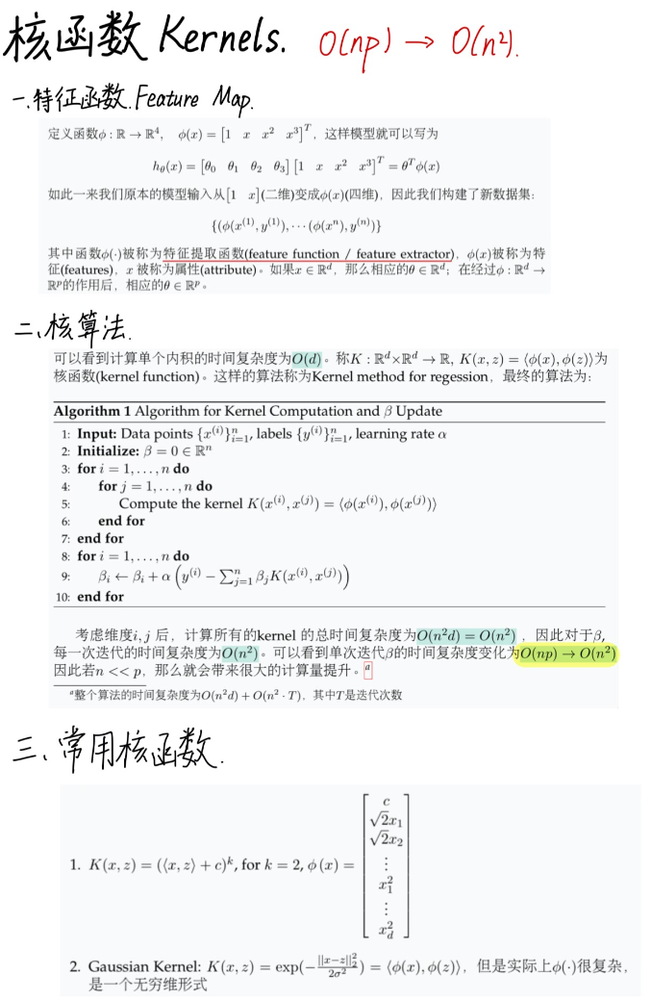

# Standford CS229 2022Fall，第六讲：核函数 (Kernels)

## 思维导图


## 特征函数 (Feature Function)

**引言：三次多项式回归**

数据集为 $\{(x^{(1)}, y^{(1)}), \cdots, (x^{(n)}, y^{(n)})\}$。

在基本线性回归 (Linear Regression) 模型 $h_\theta(x) = \theta x + \theta_0$ 中，我们仅使用了 $x$ 自身进行数据拟合。但通常需要更复杂的模型，例如三次多项式 (cubic polynomial) 模型：

$$
h_\theta(x) = \theta_3 x^3 + \theta_2 x^2 + \theta_1 x_1 + \theta_0, \quad x \in \mathbb{R}
$$

显然，模型 $h_\theta(x)$ 关于 $x$ 是非线性的，但关于参数 $\theta$ 却是线性的。我们只需做出一些改变，就可以将关于 $x$ 的非线性模型变为关于 $\theta$ 的线性模型。

> **注解**:
> a. 其中 $\theta$ 代表全体参数。
> b. 我们关注的核心实际上是在参数空间中对 $\theta$ 进行优化。

### 特征映射 / 特征提取器 (Feature Map/ Feature Extractor) (三次多项式回归案例)

定义函数 $\phi: \mathbb{R} \to \mathbb{R}^4$, $\phi(x) = [1, x, x^2, x^3]^T$，这样模型就可以写为：

$$
h_\theta(x) = [\theta_0, \theta_1, \theta_2, \theta_3] \cdot [1, x, x^2, x^3]^T = \theta^T \phi(x)
$$

如此一来，我们原本的模型输入从 $[1, x]$ (二维) 变成 $\phi(x)$ (四维)，因此我们构建了新数据集：

$$
\{(\phi(x^{(1)}), y^{(1)}), \cdots, (\phi(x^{(n)}), y^{(n)})\}
$$

其中函数 $\phi(\cdot)$ 被称为特征提取函数 (feature function/ feature extractor)，$\phi(x)$ 被称为特征 (features)，$x$ 被称为属性 (attribute)。如果 $x \in \mathbb{R}^d$，那么相应的 $\theta \in \mathbb{R}^d$；在经过 $\phi: \mathbb{R}^d \to \mathbb{R}^p$ 的作用后，相应的 $\theta \in \mathbb{R}^p$。

---

## 核技巧 / 核化 (Kernel Trick/ Kernelized)

### 基本设置 (Basic Settings)

在新数据集上做线性回归，并使用梯度下降 (GD) 进行优化，学习率为 $\alpha$，此时损失函数和参数 $\theta$ 的更新过程分别为式 (1a)(1b)：

$$
\text{loss} = \frac{1}{2} \sum_{i=1}^{n} (y^{(i)} - \theta^T \phi(x^{(i)}))^2 \quad \text{(1a)}
$$

$$
\theta := \theta + \alpha \cdot \sum_{i=1}^{n} (y^{(i)} - \theta^T \phi(x^{(i)})) \phi(x^{(i)}) \quad \text{(1b)}
$$

考虑 $x \in \mathbb{R}^d$，使用三次多项式回归，那么 $\phi(x) \in \mathbb{R}^p$，其中 $p = 1 + \| \{x_i \cdot x_j\} \| + \| \{x_i \cdot x_j \cdot x_k\} \| = 1 + d + d^2 + d^3$ (考虑重复情形)。因此每一次参数 $\theta$ 的更新都会有 $O(np)$ 的计算量，这是十分巨大的。

### 核技巧 (Kernel Trick)

**命题 1 (关键观察)**: 若 $\theta_0 = 0$，那么 $\theta$ 可以表示为特征的线性组合，即：

$$
\theta = \sum_{i=1}^{n} \beta_i \phi(x^{(i)}) \quad \text{(2)}
$$

其中 $\beta_1, \cdots, \beta_n \in \mathbb{R}$，$\theta_0$ 是 $\theta$ 的初始值。

**证明**: 我们使用数学归纳法 (induction)。

*   当 iteration = 0 时，$\theta = 0 = \sum_{i=1}^{n} 0 \cdot \phi(x^{(i)})$ 显然是特征的线性组合；
*   当 iteration = 1 时，$\theta := \theta + \alpha \sum_{i=1}^{n} (y^{(i)} - \theta^T \phi(x^{(i)})) \phi(x^{(i)}) = \alpha \sum_{i=1}^{n} y^{(i)} \phi(x^{(i)})$，此时 $\beta_i := \alpha y^{(i)}$。
*   假设 iteration = t 时结论成立，即 $\theta = \sum_{i=1}^{n} \beta_i \phi(x^{(i)})$，则 iteration = t+1 时：

$$
\theta := \theta + \alpha \sum_{i=1}^{n} (y^{(i)} - \theta^T \phi(x^{(i)})) \phi(x^{(i)}) = \sum_{i=1}^{n} ((\beta_i + \alpha (y^{(i)} - \theta^T \phi(x^{(i)}))) \phi(x^{(i)}))
$$

$$
\beta_i := \beta_i + \alpha (y^{(i)} - \theta^T \phi(x^{(i)})) \quad \text{(3)}
$$

**技巧 1: 参数存储**

已知 $\theta \in \mathbb{R}^p$，但是现在我们不需要直接存储 $\theta$ 而是存储系数 $\beta_i$，这只需要 $n$ 个存储。不妨假设 $p >> n$，那么这将带来一些计算量的降低。

**问题 1: 仍然与 $\theta$ 相关**

从式 (3) 可以看到 $\beta$ 的更新实际上与 $\theta$ 相关，仍需 $O(p)$ 的计算量，因此我们需要找到 $\beta$ 只依赖于自身的更新模式：

$$
\beta_i := \beta_i + \alpha (y^{(i)} - \theta^T \phi(x^{(i)})) = \beta_i + \alpha \left( y^{(i)} - \left( \sum_{j=1}^{n} \beta_j \phi(x^{(j)}) \right)^T \phi(x^{(i)}) \right)
$$

$$
= \beta_i + \alpha (y^{(i)} - \sum_{j=1}^{n} \beta_j \langle \phi(x^{(j)}), \phi(x^{(j)}) \rangle ) \quad \text{(4)}
$$

**问题 2: 内积计算代价高昂**

但是可以看到在计算内积 $\langle \phi(x^{(j)}), \phi(x^{(j)}) \rangle$ 时，仍然需要 $O(np)$ 的计算量，下面有两个简化方式 (技巧 2)：

*   **① 预处理**: $\langle \phi(x^{(j)}), \phi(x^{(j)}) \rangle$ 可以被预处理 (preprocessed) 并存储，因为 $\forall i, j$，内积计算过一次后就无需重复计算了。
*   **② 形式化计算**: 无需精确地将复杂的 $\phi(\cdot)$ 带入 $\langle \phi(x^{(j)}), \phi(x^{(j)}) \rangle$ 中也可以进行计算：

$$
\langle \phi(x), \phi(z) \rangle = [1, x_1, \cdots, x_d, x_1^2, \cdots, x_d^2, x_1^3, \cdots, x_d^3] \cdot [1, z_1, \cdots, z_d, z_1^2, \cdots, z_d^2, z_1^3, \cdots, z_d^3]^T
$$

$$
= 1 + \sum_{i=1}^{d} x_i z_i + \sum_{i=1,j=1}^{d} x_i x_j \cdot z_i z_j + \sum_{i,j,k=1}^{d} x_i x_j x_k z_i z_j z_k
$$

$$
= 1 + \langle x, z \rangle + \left( \sum_{i=1}^{d} x_i z_i \right) \left( \sum_{j=1}^{d} x_j z_j \right) + \left( \sum_{i=1}^{d} x_i z_i \right) \left( \sum_{j=1}^{d} x_j z_j \right) \left( \sum_{k=1}^{d} x_k z_k \right)
$$

$$
= 1 + \langle x, z \rangle + \langle x, z \rangle^2 + \langle x, z \rangle^3
$$

可以看到计算单个内积的时间复杂度为 $O(d)$。称 $K: \mathbb{R}^d \times \mathbb{R}^d \to \mathbb{R}$, $K(x, z) = \langle \phi(x), \phi(z) \rangle$ 为核函数 (kernel function)。这样的算法称为 Kernel method for regression，最终的算法为：

### 算法与时间复杂度 (Algorithm and Time complexity)

**算法 1: 核计算与 $\beta$ 更新算法**

```python
1: 输入: 数据点 {x^(i)}_i=1^n, 标签 {y^(i)}_i=1^n, 学习率 α
2: 初始化: β = 0 ∈ R^n
3: for i = 1,..., n do
4:     for j = 1,..., n do
5:         计算核 K(x^(i), x^(j)) = <ϕ(x^(i)), ϕ(x^(j))>
6:     end for
7: end for
8: for i = 1,..., n do
9:     β_i ← β_i + α(y^(i) − ∑_j=1^n β_j K(x^(i), x^(j)))
10: end for
```

考虑维度 $i, j$ 后，计算所有的核的总时间复杂度为 $O(n^2 d) = O(n^2)$，因此对于 $\beta$，每一次迭代的时间复杂度为 $O(n^2)$。可以看到单次迭代 $\beta$ 的时间复杂度变化为 $O(np) \to O(n^2)$，因此若 $n << p$，那么就会带来很大的计算量提升。

> **注解**:
> a. 整个算法的时间复杂度为 $O(n^2 d) + O(n^2 \cdot T)$，其中 $T$ 是迭代次数。

---

## 设计核函数 (Design Kernel Function)

### 改变算法流程

从上述推导过程来看，我们将 $K(\cdot, \cdot)$ 从特征函数的内积形式化成为原数据的内积进而减少了计算量。在进行测试时，给定一个 $x$，根据式 (3) 和命题 1 需要计算：

$$
\theta^T \phi(x) = \left( \sum_{i=1}^{n} \beta_i \phi(x^{(i)}) \right)^T \phi(x) = \sum_{i=1}^{n} \beta_i K(x^{(i)}, x)
$$

可以看到此时测试时仍然需要训练数据，与之前训练好之后就无需训练数据只需训练好的参数的情况不同。

这里的 $K$ 的设计要 make sense，要有意义。

因此：

**设计一个好的 $\phi$ ⇔ 设计一个好的 $K$**

**定理 1 (设计 $K$ 的必要且等价条件)**: 假设 $x^{(1)}, \cdots, x^{(n)}$ 是 $n$ 个数据点，令 $K \in \mathbb{R}^{n \times n}$ 为核矩阵，其中 $K_{ij} = K(x^{(i)}, x^{(j)})$。$K$ 是一个有效的核函数 $\Leftrightarrow$ 对于任意 $x^{(1)}, \cdots, x^{(n)}$，核函数 $K$ 是半正定 (PSD, positive semi-definite) 的。

**证明**: 暂略。

如此一来我们的工作流程就反过来变为了:

设计一个好的核函数 $K$ → 确定 $K$ 有效 (通过定理 1 或者解出 $\phi(\cdot)$) → 运行算法

---

## 扩展内容 (Extended content)

常用的核函数有：

1.  $K(x, z) = (\langle x, z \rangle + c)^k$, for $k=2$, $\phi(x) = \begin{bmatrix} c \\ \sqrt{2}x_1 \\ \sqrt{2}x_2 \\ \vdots \\ x_1^2 \\ \vdots \\ x_d^2 \end{bmatrix}$
2.  高斯核 (Gaussian Kernel): $K(x, z) = \exp(-\frac{\|x-z\|_2^2}{2\sigma^2}) = \langle \phi(x), \phi(z) \rangle$，但是实际上 $\phi(\cdot)$ 很复杂，是一个无穷维形式。

有时特征也被视为相似性度量 (similarity metric)，可以将 $K(x, z)$ 看作一种测量 $x$ 和 $z$ 的方式 (measure)。

核方法真正的改变是将 $O(np) \to O(n^2)$，当 $n<<p$ 时这较有效，但是现在的数据集往往很大，因此核方法现在并不是一个很高效和常用的方法；同时核函数的设计并不很容易，同时可解释性也是一个困难。事实上神经网络 (NN) 也可以写为 $\theta^T \phi_w(x)$，其中 $w$ 代表 NN 中的参数，而此 $\phi_w$ 是直接从数据中学习得到的，而非人工设计的，但是有效性却出奇的好。
