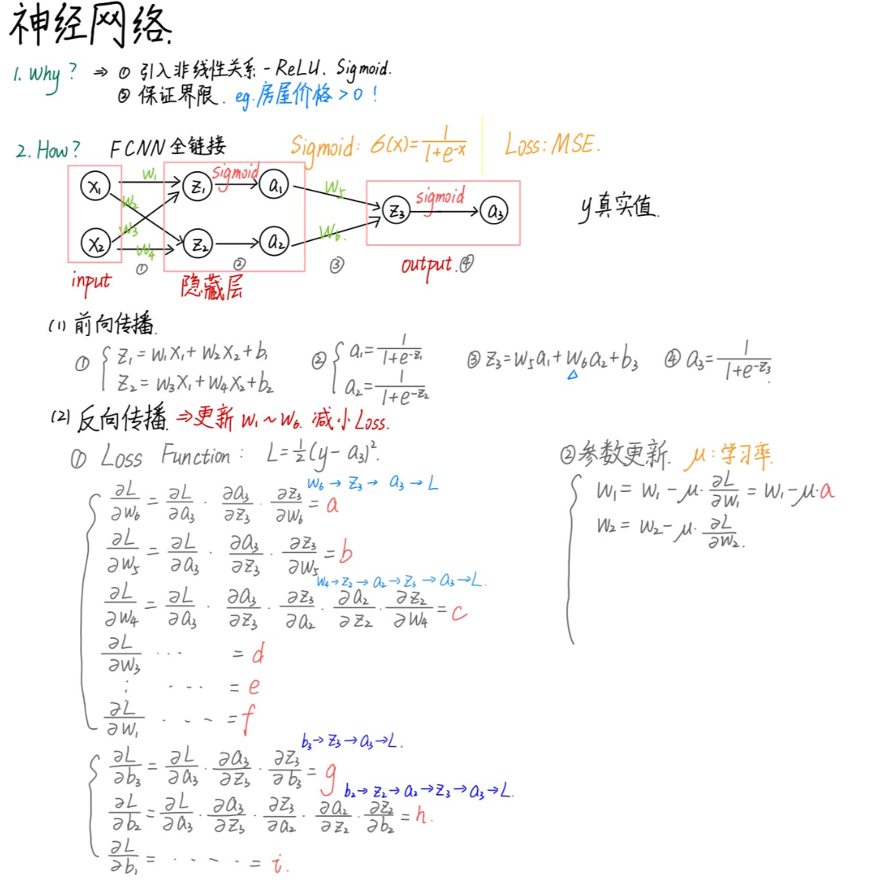
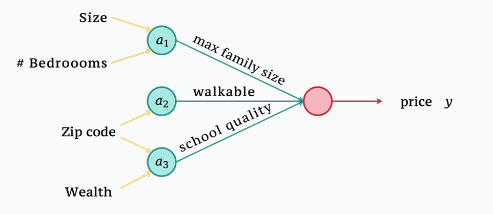
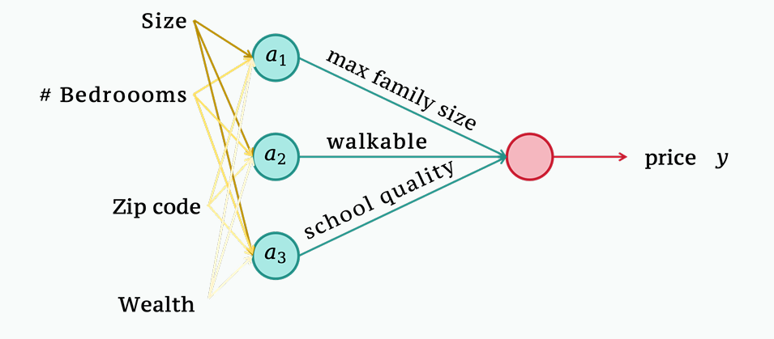

# Standford CS229 2022Fall，第7讲, 神经网络1

## 思维导图


## 回顾

### 线性与非线性模型

数据集: $\{x^{(i)}, y^{(i)}\}_{i=1}^n$, $x^{(i)} \in \mathbb{R}^d$, $y^{(i)} \in \mathbb{R}$; $h_\theta: \mathbb{R}^d \to \mathbb{R}$

**线性回归**

*   **模型**: $h_\theta(x) = \theta^T x + b$ (线性)
*   **代价/损失函数**: $J(\theta) = \frac{1}{2} \sum_{i=1}^n (h_\theta(x^{(i)}) - y^{(i)})^2$
*   **优化**: 运行梯度下降(GD)或随机梯度下降(SGD)进行优化

**非线性模型：核方法**

*   **模型**: $h_\theta(x) = \theta^T \phi(x)$ (对参数 $\theta$ 是线性的，对输入 $x$ 是非线性的)

可以看到，即使是非线性模型，核方法也只是对输入 $x$ 非线性，但是对参数 $\theta$ 仍然是线性的。那么如果希望完全是非线性的模型该怎么办呢？例如 $h_\theta(x) = \sqrt{\theta_1^3 x^2} + \sqrt{\theta_5 x^4}$。

详见附录A

---

## 神经网络

### 神经网络 – 介绍

例如我们考虑房价预测问题，使用房屋面积线性预测房屋价格，如图1所示。
> 
> Figure 1: house price prediction

但是是时候会有两个明显的问题：
1.  房屋面积与价格可能并非简单的线性关系，而是有更加复杂的非线性关系。
2.  线形模型可能导致某些面积下房屋价格为负，显然不合常理，图1就是这种情况。

线性整流函数（Rectified Linear Unit, ReLU）事实上可以解决上述问题，
$$ \text{ReLU}(x) = \max\{0, x\} $$

因此显然ReLU：
1.  是非线性函数；
2.  可以防止房价出现负数的情况。

因此我们将输出写为
$$ h_\theta(x) = \text{ReLU}(\omega x + b) \quad (1) $$

在高维 $x \in \mathbb{R}^d$ 情形下，写为：
$$ h_\theta(x) = \text{ReLU}(\omega x + b), \quad x \in \mathbb{R}^d, \omega \in \mathbb{R}^d, b \in \mathbb{R} \quad (2) $$

在神经网络(Neural networks)中，一个式(2)被称为一个神经元(neuron)，深度学习要做的是堆叠若干个、若干层这样的神经元，且上一层的输出就是下一层的输入。此时$\omega x + b$被称为预激活值(pre-activation)，其被激活函数作用后称为激活值(activation)：
```
output of activation → input of the next neuron → pre-activtion → activation
```

> a 非线形体现在”转折点”，事实上在深度学习中这就是激活函数(activation function)。

### 神经网络 – 示例

以 $x \in \mathbb{R}^4$ 为例，其中 $x_1$: size, $x_2$: # bedrooms, $x_3$: zip code, $x_4$: wealth。除了这些特征外，我们可以根据经验再依据这些特征构建一些中间变量(intermediate variables)以更好进行预测，例如：

1.  $a_1$: max family size，与 size和# bedrooms相关，故 $a_1 = \text{ReLU}(\omega_1 x_1 + \omega_1 x_2 + b_1)$
2.  $a_2$: walkable, 与 zip code相关，故 $a_2 = \text{ReLU}(\omega_3 x_3 + b_2)$
3.  $a_3$: school quality，与 zip code和 wealth相关，故 $a_3 = \text{ReLU}(\omega_4 x_3 + \omega_5 x_4 + b_3)$

这样最后得到的输出(如图2所示)为：
$$ h_\theta(x) = \omega_6 a_1 + \omega_7 a_2 + \omega_8 a_3 + b_4, \quad \theta = \{\omega_1, \cdots, \omega_8, b_1, \cdots, b_4\} \quad (3) $$
> 
> Figure 2: house price prediction example

### 神经网络 – 一般情况

从上面的例子可以发现，我们组建新的特征时是基于我们的先验知识的，这需要很高的代价，并且很多时候也并不全部准确。因此我们可以考虑将层间所有的神经元都链接起来，让模型自己提取有用的特征，即如图3所示，此时称这种网络为全链接神经网络(fully connected neural network, FCNN)。图中共有两层神经元，除开输出层的都称为隐藏层。

> 
> Figure 3: fully connected neural networks

这样之后，我们就可以将此全链接神经网络数学地写为：
$$
\begin{cases}
a_1 = \text{ReLU}(w^{[1]}_1 x + b^{[1]}_1), & w^{[1]}_1 \in \mathbb{R}^4, x \in \mathbb{R}^4, b^{[1]}_1 \in \mathbb{R} \\
a_2 = \text{ReLU}(w^{[1]}_2 x + b^{[1]}_2), & w^{[1]}_2 \in \mathbb{R}^4, x \in \mathbb{R}^4, b^{[1]}_2 \in \mathbb{R} \\
a_3 = \text{ReLU}(w^{[1]}_3 x + b^{[1]}_3), & w^{[1]}_3 \in \mathbb{R}^4, x \in \mathbb{R}^4, b^{[1]}_3 \in \mathbb{R}
\end{cases}
\quad (4a)
$$
$$
\Rightarrow h_\theta(x) = w^{[2]} a + b^{[2]}, \quad w^{[2]} \in \mathbb{R}^3, a \in \mathbb{R}^3, b^{[2]} \in \mathbb{R} \quad (4b)
$$

**向量化 (Vectorization)**: 为得到更简洁的表示，并且帮助 GPU 并行化，需要将上述数学表示向量化。同时我们将其推广到共 $r$ 层神经元、隐藏层中每一层有 $m_k, k= 1, \cdots, r - 1$ 个神经元的一般情形：

$$
W^{[1]} = \begin{bmatrix}
-- (w^{[1]}_1)^T -- \\
-- (w^{[1]}_2)^T -- \\
\cdots \\
-- (w^{[1]}_{m_1})^T --
\end{bmatrix} \in \mathbb{R}^{m_1 \times d}, \quad
b^{[1]} = \begin{bmatrix}
b^{[1]}_1 \\
b^{[1]}_2 \\
\cdots \\
b^{[1]}_{m_1}
\end{bmatrix} \in \mathbb{R}^{m_1 \times 1}, \quad
x = \begin{bmatrix}
x_1 \\
x_2 \\
\cdots \\
x_d
\end{bmatrix} \in \mathbb{R}^{d \times 1}
\quad (5)
$$

其中上标 $[1]$ 表示第1层，这样得到第一层的预激活值(pre-activation)为
$$
z^{[1]} = W^{[1]} x + b^{[1]}, \quad
\begin{bmatrix}
z^{[1]}_1 \\
\cdots \\
z^{[1]}_{m_1}
\end{bmatrix} \in \mathbb{R}^{m_1 \times 1} =
\begin{bmatrix}
-- w^{[1]\top}_1 -- \\
-- w^{[1]\top}_2 -- \\
\cdots \\
-- w^{[1]\top}_{m_1} --
\end{bmatrix} \in \mathbb{R}^{m_1 \times d}
\begin{bmatrix}
x_1 \\
x_2 \\
\cdots \\
x_d
\end{bmatrix} \in \mathbb{R}^{d \times 1}
+
\begin{bmatrix}
b^{[1]}_1 \\
b^{[1]}_2 \\
\cdots \\
b^{[1]}_{m_1}
\end{bmatrix} \in \mathbb{R}^{m_1 \times 1}
\quad (6)
$$

第一层的激活值(activation)为
$$
a^{[1]} = \begin{bmatrix}
a^{[1]}_1 \\
a^{[1]}_2 \\
\cdots \\
a^{[1]}_{m_1}
\end{bmatrix} = \begin{bmatrix}
\text{ReLU}(z^{[1]}_1) \\
\text{ReLU}(z^{[1]}_2) \\
\cdots \\
\text{ReLU}(z^{[1]}_{m_1})
\end{bmatrix} \triangleq \text{ReLU}(z^{[1]}) \quad (7)
$$

第 $k$ 层的预激活值和激活值分别为 $z^{[k]} = W^{[k]} a^{[k-1]} + b^{[k]}$ 和 $a^{[k]} = \text{ReLU}(z^{[k]})$:
$$
z^{[k]} = \begin{bmatrix}
z^{[k]}_1 \\
\cdots \\
z^{[k]}_{m_k}
\end{bmatrix} \in \mathbb{R}^{m_k \times 1} =
\begin{bmatrix}
-- w^{[k]\top}_1 -- \\
-- w^{[k]\top}_2 -- \\
\cdots \\
-- w^{[k]\top}_{m_k} --
\end{bmatrix} \in \mathbb{R}^{m_k \times m_{k-1}}
\begin{bmatrix}
a^{[k-1]}_1 \\
a^{[k-1]}_2 \\
\cdots \\
a^{[k-1]}_{m_{k-1}}
\end{bmatrix} \in \mathbb{R}^{m_{k-1} \times 1}
+
\begin{bmatrix}
b^{[k]}_1 \\
b^{[k]}_2 \\
\cdots \\
b^{[k]}_{m_k}
\end{bmatrix} \in \mathbb{R}^{m_k \times 1}
\quad (8)
$$
$$
a^{[k]} = \begin{bmatrix}
a^{[k]}_1 \\
a^{[k]}_2 \\
\cdots \\
a^{[k]}_{m_k}
\end{bmatrix} = \begin{bmatrix}
\text{ReLU}(z^{[k]}_1) \\
\text{ReLU}(z^{[k]}_2) \\
\cdots \\
\text{ReLU}(z^{[k]}_{m_k})
\end{bmatrix} \triangleq \text{ReLU}(z^{[k]}) \quad (9)
$$

最后全部层的向前传播公式为：
$$
\begin{aligned}
a^{[1]} &= \text{ReLU}(W^{[1]} x + b^{[1]}) \\
a^{[2]} &= \text{ReLU}(W^{[2]} a^{[1]} + b^{[2]}) \\
&\cdots \\
a^{[r-1]} &= \text{ReLU}(W^{[r-1]} a^{[r-2]} + b^{[r-1]}) \\
h_\theta(x) &= W^{[r]} a^{[r-1]} + b^{[r]}
\end{aligned}
\quad (10)
$$

---

## 为什么我们需要激活函数？

激活函数(activation function)在神经网络中是非常重要的，其作用是引入非线性关系，从而增强模型的表达能力，常见的激活函数有：


| 函数 (Function) | 公式 (Formula) | 范围 (Range) | 导数特性 (Derivative Characteristics) |
| :--- | :--- | :--- | :--- |
| **Sigmoid** | $\sigma(x) = \frac{1}{1+e^{-x}}$ | $(0, 1)$ | 对于大的 $|x|$，梯度消失 (Vanishing gradient for large $|x|$) |
| **Tanh** | $\tanh(x) = \frac{e^x - e^{-x}}{e^x + e^{-x}}$ | $(-1, 1)$ | 零中心化，对于大的 $|x|$，梯度消失 (Zero-centered, vanishing gradient for large $|x|$) |
| **ReLU** | $\text{ReLU}(x) = \max(0, x)$ | $[0, \infty)$ | 非饱和，当 $x < 0$ 时梯度为0 (Non-saturating, gradient is 0 for $x < 0$) |
| **Leaky ReLU** | $\text{LReLU}(x) = \begin{cases} x, & x \ge 0 \\ \alpha x, & x < 0 \end{cases}$ | $(-\infty, \infty)$ | 当 $x < 0$ 时梯度非零（由 $\alpha$ 控制）(Non-zero gradient for $x < 0$ (controlled by $\alpha$)) |
| **Softmax** | $\text{Softmax}(x_i) = \frac{e^{x_i}}{\sum_j e^{x_j}}$ | $(0, 1)$ | 用于多分类，输出总和为1 (Used for multi-class classification, sum of outputs = 1) |

**注释**:
1.  ReLU: Rectified Linear Unit; Leaky ReLU 中的 $\alpha$ 通常是一个很小的正数（例如，0.01）。
2.  Sigmoid 和 Tanh 在深层网络中容易遭受梯度消失问题。

如果没有激活函数作用，那么以两层神经网络为例：
$$
a^{[1]} = W^{[1]} x + b^{[1]}, \quad h_\theta(x) = W^{[2]} a^{[1]} + b^{[2]} = W^{[2]} W^{[1]} x + W^{[2]} b^{[1]} + b^{[2]} \quad (11)
$$
其仍然是一个线形的，并且等价于一层线性层作用。

在 kernel methods 中：
$$
a = \phi(x), \quad h(x) = W a + b = W \phi(x) + b \quad (12)
$$
我们使用 feature map $\phi(x)$ 自主选择了需要的特征(features)，但是在神经网络中，我们实际上是通过学习得到的 $\phi(\cdot)$，因此在隐藏层也称为 features/ representations learning，中间得到的 $a^{[k]}$ 也被称为 features/ representations.

---

## 问题

**问题: 核方法与神经网络**

如果在神经网络中每一层再加上一部 kernel 的作用会怎么样呢？即：
$$
a^{[r-1]} = \phi_\beta(a^{[r-2]}), \quad \beta = \{W^{[1]}, \cdots, W^{[r-1]}, b^{[1]}, \cdots, b^{[r-1]}\}
$$
$$
h(x) = W^{[r]} a^{[r-1]} + b^{[r]} \quad (13)
$$

1.  这样会导致神经网络表达能力更强吗？
2.  还是说理论上可以证明即使加了 kernel methods 二者的表达能力相同？
3.  即使理论上表达能力相同，实际效果是否有差异？
4.  如果理论上就强那可以弥补带来的计算量上升吗？

---

## 不同的优化方法

### 不同的优化方法

**算法 1: 全梯度下降 (Full Gradient Descent)**

```
Require: Dataset {(xi, yi)}iN=1, loss function J(θ), learning rate η
1: Initialize parameters θ
2: repeat
3:   Compute gradient: g = 1/N ∑_{i=1}^N ∇J_i(θ)
4:   Update parameters: θ ← θ − η · g
5: until convergence
```

**算法 2: 随机梯度下降 (SGD)**

```
Require: Dataset {(xi, yi)}iN=1, loss function J(θ), learning rate η
1: Initialize parameters θ
2: repeat
3:   Randomly sample a data point (xi, yi)
4:   Compute gradient: g = ∇J_i(θ)
5:   Update parameters: θ ← θ − η · g
6: until convergence
```

**算法 3: 小批量梯度下降 (Mini-batch Gradient Descent)**

```
Require: Dataset {(xi, yi)}iN=1, loss function J(θ), learning rate η, batch size m
1: Initialize parameters θ
2: repeat
3:   Randomly sample a mini-batch B of m data points
4:   Compute gradient: g = 1/m ∑_{i∈B} ∇J_i(θ)
5:   Update parameters: θ ← θ − η · g
6: until convergence
```
