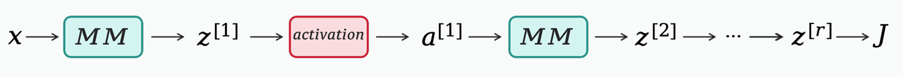

# Standford CS229 2022Fall，第8讲, 神经网络2 (反向传播)

## 回顾

### 损失函数与参数更新

在神经网络中，第 $i$ 个样本 $x^{(i)}$ 产生的损失为：
$$ J^{(i)} = \frac{1}{2}(y^{(i)} - h_\theta(x^{(i)}))^2 $$

用该样本更新参数 $\theta$ 的算法为：
$$ \theta := \theta - \alpha \nabla J^{(i)}(\theta) $$
其中 $\alpha$ 为学习率。此时问题的重点就变成如何求得梯度 $\nabla J^{(i)}(\theta)$。

---

## 可微分电路/网络

在介绍如何求得梯度之前，先了解一下梯度是否能计算、好计算是必要的。下面先介绍可微分电路/网络（Differentiable circuits/networks），其是二阶方法和元学习的基础。

**定义 1 (可微分电路/网络)**: 称由一系列基本算符 ($+, -, \times, /$) 和基本函数 (例如 $\cos, \sin, \exp, \log, \text{ReLU}$ 等) 组合而成的组合体为可微分电路/网络。

对于此可微分电路，事实上可以说明用其计算导数是可以做到且并不困难：

**定理 1**: 设一实值函数 $f: \mathbb{R}^l \to \mathbb{R}$ 可被大小为 $N$ 的可微分电路计算出，那么其梯度 $\nabla f \in \mathbb{R}^l$ 可以被大小为 $O(N)$ 的可微分电路计算出，且计算时间复杂度为 $O(N)$。

**注释**:
1.  定理 1 中隐含地假设了 $N > l$，因为要计算出所有 $l$ 维度的值。
2.  定理 1 表明对于一个电路，计算函数值 $f$ 与计算其梯度 $\nabla f$ 所需时间差不多，因此计算梯度并不比计算损失本身更困难！
3.  应用于神经网络中，$f$ 即 $J^{(i)}(\theta)$，$l =$ 参数数量，$N = O($参数数量$)$。

**推论 1**: 在相同的设置下，$\forall v \in \mathbb{R}^l$，计算 $\nabla^2 f(x) \cdot v$ 的时间复杂度为 $O(N + l)$。

**证明**: 事实上，如果先计算 $\nabla^2 f(x)$ 就有 $O(l^2)$ 的计算量，再做内积就有 $O(l^2 + l)$ 的计算量。但是，令 $g(x) := \langle \nabla f(x), v \rangle: \mathbb{R}^l \to \mathbb{R}$，由定理 1 可知 $g(x)$ 的计算量为 $O(N + l)$，再次使用定理 1 可知 $\nabla g = \nabla \langle \nabla f, v \rangle$ 的计算量依然为 $O(N + l)$。

> **a** 更多介绍可见 Differentiable Circuits And PyTorch

---

## 预备知识 – 链式法则

**设定**: $J(\theta_1, \theta_2, \cdots, \theta_p)$ 为自变量为 $\theta_1, \theta_2, \cdots, \theta_p$ 的函数，并有中间变量 $g_1 = g_1(\theta_1, \theta_2, \cdots, \theta_p), \cdots, g_k = g_k(\theta_1, \theta_2, \cdots, \theta_p)$，因此 $J$ 也可以写为 $J(g_1, g_2, \cdots, g_k)$。

**链式法则**:
$$ \frac{\partial J}{\partial \theta_i} = \sum_{j=1}^{k} \frac{\partial J}{\partial g_j} \cdot \frac{\partial g_j}{\partial \theta_i} $$

若 $\theta \in \mathbb{R}$，则 $\frac{\partial J}{\partial \theta} \in \mathbb{R}$；若 $\theta \in \mathbb{R}^d$，则 $\frac{\partial J}{\partial \theta} = \begin{bmatrix} \frac{\partial J}{\partial \theta_1} \\ \vdots \\ \frac{\partial J}{\partial \theta_d} \end{bmatrix} \in \mathbb{R}^d$；若 $A \in \mathbb{R}^{d_1 \times d_2}$，则 $\frac{\partial J}{\partial A} = \left[ \frac{\partial J}{\partial A_{ij}} \right] \in \mathbb{R}^{d_1 \times d_2}$。

---

## 反向传播

### 两层神经网络的链式法则

**设定**: 我们考虑简单的两层神经网络：
$$
\begin{aligned}
z &= W^{[1]} x + b^{[1]} \in \mathbb{R}^m, \quad x \in \mathbb{R}^d, W^{[1]} \in \mathbb{R}^{m \times d}, b^{[1]} \in \mathbb{R}^d \\
a &= \sigma(z) \in \mathbb{R}^m \\
h_\theta(x) &= o = W^{[2]} a + b^{[2]} \in \mathbb{R}^1 \\
J &= \frac{1}{2}(y - o)^2
\end{aligned}
$$

**抽象化**: 我们首先抽象地形式化看看计算梯度会发生什么，先设：
$$ J = J(z), \quad z = Wu + b, \quad x \in \mathbb{R}^d, W \in \mathbb{R}^{m \times d}, b \in \mathbb{R}^d $$

那么根据链式法则就有：
$$
\frac{\partial J}{\partial W} = \frac{\partial J}{\partial z} \cdot u^T, \quad \frac{\partial J}{\partial b} = \frac{\partial J}{\partial z}
$$
具体展开为：
$$
\frac{\partial J}{\partial W_{ij}} = \sum_{k=1}^{m} \frac{\partial J}{\partial z_k} \frac{\partial z_k}{\partial W_{ij}} = \sum_{k=1}^{m} \frac{\partial J}{\partial z_k} \cdot \frac{\partial (W_{k1}u_1 + W_{k2}u_2 + \cdots + W_{kd}u_d + b_k)}{\partial W_{ij}} = \frac{\partial J}{\partial z_k} \cdot u_j
$$

**应用到两层神经网络**: 我们想要计算损失函数关于神经网络参数的梯度，根据上面的结果就有：
$$
\frac{\partial J}{\partial W^{[1]}} = \frac{\partial J}{\partial z} \cdot x^T, \quad \frac{\partial J}{\partial b^{[1]}} = \frac{\partial J}{\partial z}, \quad \frac{\partial J}{\partial W^{[2]}} = \frac{\partial J}{\partial o} \cdot a^T, \quad \frac{\partial J}{\partial b^{[2]}} = \frac{\partial J}{\partial o}
$$

由于 $a = \sigma(z) \in \mathbb{R}^m$, $J = J(a)$，因此有：
$$
\frac{\partial J}{\partial z} = \frac{\partial J}{\partial a} \odot \sigma'(z)
$$
其中 $\odot$ 指按元素相乘（entry-wise），因为激活函数 $\sigma$ 的作用也是按元素进行的。

对于 $\frac{\partial J}{\partial a}$，有：
$$
\frac{\partial J}{\partial a} = \frac{\partial J}{\partial o} \cdot \frac{\partial o}{\partial a} = w^{[2]} \cdot \frac{\partial J}{\partial o}
$$

对于 $\frac{\partial J}{\partial o}$，有：
$$
\frac{\partial J}{\partial o} = -(y - o)
$$

---

### 深度神经网络的链式法则

**设定**: 考虑一个 $r$ 层的深度神经网络：
$$
\begin{aligned}
z^{[1]} &= w^{[1]} x + b^{[1]} \in \mathbb{R}^m \\
a^{[1]} &= \sigma(z^{[1]}) \\
z^{[2]} &= w^{[2]} a^{[1]} + b^{[2]} \\
&\cdots \\
a^{[r-1]} &= \sigma(z^{[r-1]}) \\
z^{[r]} &= w^{[r]} a^{[r-1]} + b^{[r]} \\
J &= \frac{1}{2}(y - z^{[r]})^2
\end{aligned}
$$

**链式法则**: 我们要计算损失 $J$ 对第 $k$ 层参数 $W^{[k]}, b^{[k]}$ 的梯度。由于
$$
z^{[k]} = W^{[k]} \cdot a^{[k-1]} + b^{[k]}, \quad J = J(z^{[k]})
$$
因此：
$$
\frac{\partial J}{\partial W^{[k]}} = \frac{\partial J}{\partial z^{[k]}} \cdot (a^{[k-1]})^T
$$

由于
$$
a^{[k]} = \sigma(z^{[k]}), \quad J = J(a^{[k]})
$$
因此：
$$
\frac{\partial J}{\partial z^{[k]}} = \frac{\partial J}{\partial a^{[k]}} \odot \sigma'(z^{[k]})
$$

由于
$$
z^{[k+1]} = W^{[k+1]} \cdot a^{[k]} + b^{[k+1]}, \quad J = J(z^{[k+1]})
$$
因此：
$$
\frac{\partial J}{\partial a^{[k]}} = (W^{[k+1]})^T \frac{\partial J}{\partial a^{[k+1]}}
$$

---

## 总结

在神经网络向前传播中，如图1所示，计算顺序是：
```
前向传播 (forward pass): z^[1], a^[1] → z^[2], a^[2] → ... → z^[r], a^[r]
```
> 
> Figure 1: 前向传播
其中 MM 是一个模块(module)，指矩阵乘法(matrix multiplication)。

但是在计算梯度时，计算的顺序是：
```
反向传播 (backward pass): ∂J/∂z^[r] = -(y - z^[r]) → ∂J/∂z^[r], ∂J/∂z^[r-1] = ∂J/∂a^[r-1] ⊙ σ'(z^[r-1]) → ... → ∂J/∂a^[k], ∂J/∂z^[k] → ...
```

因此计算梯度时，MM-module 原本的输出变成了输入，输入变成了输出，这也是“反向传播”名称的由来。
